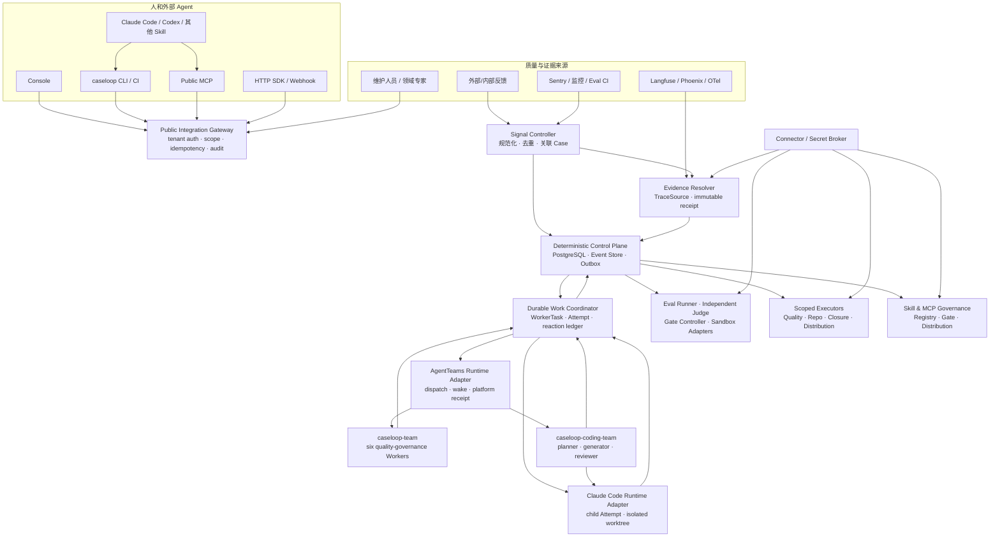

# CaseLoop v4 全盘计划（批准施工基线）

> 状态：**APPROVED TARGET / IMPLEMENTATION IN PROGRESS**
>
> 更新：2026-08-10
>
> 目的：定义 CaseLoop 从“客服参考纵切”升级为“小团队可采用的开源 Agent 质量与变更治理项目”的完整依赖顺序、架构、契约与验收。
>
> 权威边界：本文是 v4 新开发的目标架构、依赖顺序与施工基线。`docs/plan-v3.md`、现有 `contracts/`、migrations 和可执行测试继续约束已实现的 v3 客服 Scenario Pack，直到相应能力被明确的 v4 migration、contract 和测试替换。计划获批不等于功能已经实现；运行事实仍只由代码、PostgreSQL 权威记录和可复验证据证明。
>
> 研究依据：[`docs/research/demand/caseloop-v4-small-team-adoption.md`](research/demand/caseloop-v4-small-team-adoption.md)。

## 0. 总裁决

CaseLoop v4 的产品形态应是：

> **可由人或其他 Agent 调用的开源 Agent 质量维护团队。**它从外部反馈、内部反馈、维护人员报告、运行异常和自动评测中接收质量 Signal，绑定确切 Agent Run 与版本，驱动真实 Agent Team 调查和生成候选，用独立 Evaluator 与确定性 Gate 证伪，在策略允许的范围内发布、观察、回滚，并把每次问题沉淀成回归与能力资产。

“给所有 AI Agent 使用”在 v4 中的可验收含义是：核心对象和公共接口不绑定客服、coding Agent、某个 runtime 或某家 provider；任何能提供 Signal、运行/版本证据以及相应验证或动作 Adapter 的 Agent 都可以接入。它不表示对无法观测、无法版本化、无法复验或无法隔离外部副作用的黑盒 Agent 也承诺自动归因和自动修复；这类对象必须降级为观察、人工补证或 `UNKNOWN`。

它不是：

- 智能客服产品；
- 通用 Agent runtime 或聊天式编排平台；
- Langfuse/Phoenix 的替代品；
- 一个把所有业务步骤写进脚本的超级 runner；
- 让多个 LLM 互相同意就自动修改生产的自治系统。

## 1. v4 必须保留的铁律

1. PostgreSQL 控制面是生命周期、权限、幂等、审批、发布和审计权威；
2. LLM/Agent 只产生计划、假设、Finding、Proposal 和候选工件；
3. LLM Worker 永不持有目标系统写凭据；Quality API 写面只由 Release Controller 调用。所有 scoped `ExternalOperation` 由 `scoped-executor-controller` 唯一持有 PostgreSQL 生命周期；Repo、Release、Closure、Distribution 是范围受限、持有目标凭据的 typed Executor/Adapter，只执行已校验动作并回传 receipt，不成为共同 aggregate owner；
4. 所有发布绑定确切的 ResolutionContract、WorkOrder、GateReport、版本、nonce、expiry 与证据 digest；
5. `FAILED / INCONCLUSIVE / ERROR / UNKNOWN`、缺失、过期或不匹配都 fail closed；
6. 全库只使用 §6.4 定义的 canonical evidence facets；mock 不是 facet，platform export 不是成功 facet，任何一个 facet 通过都不能替代另一个；
7. exporter 只读，不能补造 task、ack、submit、human approval 或 Agent 工件；
8. Agent runtime、trace、eval、sandbox、Skill registry 和 release target 都通过 Adapter 接入；
9. 当前 v3 客服纵切保留为一个 Scenario Pack，不静默篡改历史契约与证据；
10. 中国用户优先，但公共契约和核心对象保持 provider-neutral。

## 2. 首批目标用户与产品入口

### 2.1 首发 ICP 建议

首发先服务 **2–8 人、运行 1–3 个真实 Agent 的国内 AI 产品团队**：一名开发者通常兼任维护负责人，已有 Langfuse、GitHub/GitLab 与飞书中的至少两项，没有专职 Agent 平台团队。

- 已有真实 Agent 流量，而不是只有演示；
- 能提供至少一种 trace/log/feedback 来源；
- 能提供至少一种可验证结果或 eval；
- 愿意先只读接入，再逐级授权草稿、canary、回滚和低风险发布；
- 采用者可能是开发者，批准者可能是业务负责人、领域专家或维护负责人。

首发暂不服务：无法取得任何运行证据、无法标识版本、无法复验/回滚，或首个场景就是不可逆 R2 高风险动作的团队。一个人可以兼任多个岗位，但系统仍区分 `Integrator / Reporter / Domain Reviewer / Release Approver` 的身份与权限。

### 2.2 两条默认接入路径

```bash
# 已有 Langfuse 负反馈：向导列出最近低分 trace 供选择
caseloop quickstart --profile local --source langfuse

# 维护人员直接报告：允许暂时没有 trace
caseloop signal submit \
  --agent coding-assistant \
  --summary "最近经常选错部署工具"
```

`caseloop report` 是 `caseloop signal submit` 的短 alias；文档、脚本和机器输出使用后者作为 canonical command。

机器模式使用同一能力层：

```bash
caseloop quickstart \
  --no-input \
  --config .caseloop/config.yaml \
  --trace-id <trace-id> \
  --output json
```

凭据只能通过交互式 stdin、OS keyring、环境变量或权限为 `0600` 的 secret file 注入，不能进入 argv、shell history 或不含 secret 的 `.caseloop/config.yaml`。成功结果必须返回确切 `workspace_id / source_id / signal_id / case_id / evidence_status / missing_fields / request_id / audit_ref / next_command`，不得以 `--latest` 作为验收定位。

首次价值目标不是“生产全自动”，而是：

> 一条已有坏 trace 进入 CaseLoop，显示来源、输入/输出摘要、确切版本、证据完整性、缺失项和一个可追踪 Case。

这个 `First Useful Case` 还必须给出跨来源去重结果、不可变 Evidence Receipt，以及一个明确下一步：补证据、启动调查或关闭误报。只复制一份 trace 或创建空 Case 不计激活。没有 trace 的维护报告进入 `NEEDS_CORRELATION`，系统给出候选 Run 或明确缺失，而不是拒绝或伪造绑定。

“五分钟”先作为 pilot 目标而不是未验证承诺：在 CLI 已安装、Docker 健康、凭据有效且网络可达的前提下，真实来源 `p50 ≤ 5 分钟、p90 ≤ 15 分钟`；fixture 冷启动和真实来源热启动分开计时并保留原始证据。

### 2.3 三种采用模式

| 模式 | 能力 | 默认外部写权限 |
|---|---|---|
| Shadow | 读 Signal/Trace、去重、立案、报告 | 无 |
| Copilot | 自动调查、候选、回归和草稿 PR/WorkOrder | 仅草稿 |
| Guarded Autopilot | 预授权低风险动作自动 canary/promote/rollback | PolicyGrant 限定 |

### 2.4 可治理能力与降级

| 最高可用模式 | 最低条件 |
|---|---|
| Shadow Observe | Signal 或可读取 Run 二者之一 |
| Shadow Investigate | 可关联 Run、版本和足够完整的 trace |
| Copilot Validate | 可复验 eval 或隔离 sandbox |
| Copilot Propose | Candidate/Repo Adapter |
| Guarded Execute | Gate、Release、Rollback 与 Approval/Policy Adapter |

缺失条件时必须降低模式并解释缺口，不能为了跑通补造版本、trace、receipt 或成功结果。

### 2.5 Pilot Evidence Gate

Stage 0 可以按已批准需求立即施工；用户验证与实现并行，不再作为可绕过或无限等待的开工门槛。正式宣称通用产品价值前，仍需至少访谈 5 个符合首发 ICP 的团队，其中 3 个提供脱敏的真实 Signal、trace 与当前人工处理流程，2 个运行 Shadow pilot。记录发现问题到验证修复的步骤、人工投入、失败点和权限边界；若没有重复出现的共同工作流，则保留已实现的最小内核和 Adapter 扩展性，但不把偶然流程继续扩成核心对象。该 Gate 约束产品声明和 Stage 1 pilot 出口，不阻止 Stage 0 契约施工。

## 3. 总体架构



### 3.1 关键分层

- Public Gateway 只接受产品级 intent，不暴露内部 Worker 微操作；
- Canonical application service 承担所有入口的共同业务语义；
- Durable Work Coordinator 只保存 inbox/outbox、reaction ledger、dispatch、retry 与 DLQ，根据权威事件创建工作；它不保存全链 `current_stage`，也不自己决定领域成功；
- Agent Runtime Adapter 只负责执行 Worker，不持有业务状态；
- AgentTeams Adapter 与 Claude Code Adapter 分开：前者证明平台 Worker dispatch/claim，后者证明 child native session 执行；任一 receipt 都不能单独冒充完整因果；
- Connector/Secret Broker 持有外部凭据，Agent 只拿 opaque capability handle；
- `AutomationRunView` 是跨聚合只读投影和事件游标，不接受 start/cancel 写命令；启动调查、停止未来工作等必须路由到明确领域命令。

## 4. v4 核心对象与契约

### 4.1 租户与被治理对象

`Workspace` → `Project` → `Environment` → `GovernedAgent`

`GovernedAgentManifest` 至少声明：

```text
agent identity / owner
runtime and environment
TraceSource binding
VersionResolver
EvalAdapter and sandbox profile
Candidate/Release/Rollback adapters
Closure adapters
data classification and retention
allowed automation policy
```

### 4.2 质量输入

- `SourceConnection`：来源配置、credential reference 与 capability 的权威记录，不保存明文 secret；
- `SourceSyncRun`：一次 source doctor/sync 的请求、终态与 unknown reconciliation；
- `SignalEnvelope`：不可变的来源事实；
- `AgentRunRef`：标准化 trace/session/span 引用；
- `TraceEvidenceReceipt`：精确查询、字段、digest、完整性和缺失；
- `QualityCase`：一个可被调查和解决的质量问题，可关联多个 Signal 与 Run。

### 4.3 Agent 工作

- `AutomationRequest`：只拥有调查 admission、调用方预算和 best-effort stop request，不拥有跨域 `current_stage` 或任何领域终态；
- `ResolutionContract`：Planner 提议、Evaluator Agent 审查可测性、Controller 冻结的问题、目标、允许修改面、公开验收、预算、风险和停止条件；
- `CandidateContract`：每个 Candidate revision 开工前冻结的本轮构建范围与公开验证方法；
- `CandidateRevision`：确切 Attempt 先在隔离 sandbox 中生成并密封候选 artifact，ChangeProposal 绑定该 `OUTPUT_RECORDED` snapshot 并在任何 Controller/repo/release 等受控动作前完成裁决；Attempt 终止后再固化不可变 artifact、diff、base/target 与 receipt 集。Proposal 不是 plan artifact、不引用未来 revision，runner 也不得预填 known-good 产物；
- `EvaluationPlan / HoldoutBinding`：Eval Controller 专属的密封考题、标签、Judge 配置、阈值和 digest；生成侧只能看到策略类别、digest 与聚合 verdict；
- `WorkerTask`：只拥有排队、lease、fencing、retry、cancel-request 与 exhausted，不拥有领域成功；
- `Attempt`：每次真实 executor/session 的输入快照、team/worker principal、parent Attempt、runtime kind/session/adapter digest、请求与实际 provider/model、模型/Skill/MCP/tool receipt、repo/base revision/worktree、capability grant、输出和 terminal semantics；fallback 必须创建新 Attempt，不允许原地静默换模型；
- `AgentIntent`：发生外部动作之前提交的非权威意图；
- `Proposal`：按 `CaseBrief / AttributionHypothesis / ChangeProposal / RegressionProposal` 等类型保存的不可变 Agent 产物；
- `ProposalDecision`：Controller 独立记录接受或拒绝，不能改写原 Proposal；
- `Finding`：Evaluator 对特定 candidate revision 的问题与证据；
- `CandidateArtifact`：prompt/knowledge/model/skill/tool/code/harness/policy 等候选。

### 4.4 领域仲裁

- `ExperimentPlan / ExperimentReport`；
- `GatePlan / GateReport`；
- `WorkOrder`；
- `ApprovalGrant`（human authority）与 `PolicyGrant`；
- `Release / Rollback / Closure`；
- `TrustLedgerEntry`。

### 4.5 能力资产

- `EvaluatorVersion / EvaluatorCalibrationSet / EvalDatasetVersion`；
- `SkillPackage / SkillManifest / SkillCandidate / SkillEvalSet / SkillEvalReport`；
- `SkillVersion / SkillAssignment / SkillRelease / SkillRevocation`；
- MCP 的 `MCPCandidate / MCPVersion / MCPAssignment / MCPEvalPlan / MCPGateReport / MCPRelease / MCPRevocation`。

### 4.6 Aggregate Ownership ADR

Stage 0 必须冻结 owner/command/event 矩阵，防止 Coordinator、Run 或 Case 复制所有阶段：

| 事实 | 唯一主人 | 明确不拥有 |
|---|---|---|
| 来源配置/单次诊断结果 | `SourceConnection / SourceSyncRun` | Signal/Case 生命周期 |
| 问题是否待解决 | `QualityCase` | Worker/Gate/Release 的内部阶段 |
| 是否准入调查、预算、停止请求 | `AutomationRequest` | Worker/Experiment/Gate/Release/Case 的领域终态 |
| Worker 是否持有任务 | `WorkerTask` | 领域成功 |
| 某次 Worker 是否执行 | `Attempt` | Proposal 是否被接受 |
| Agent 提出了什么 | immutable typed Proposal | mutable workflow |
| 是否接受候选 | `ProposalDecision` | 修改原 Proposal |
| 候选是否通过 | `GateExecution + GateReport` | Release/Case resolution |
| 外部动作结果 | `ExternalOperation`（唯一 owner：`scoped-executor-controller`；Repo/Release/Closure/Distribution 仅为 typed Executor/Adapter） | Case 是否已解决 |
| 是否解决问题 | `CaseResolutionDecision` | 通知是否投递成功 |
| 是否通知成功 | `ClosureDelivery` | 发布是否成功 |
| 总体进度 | `AutomationRunView` | 任何写命令 |
| 衍生工作是否创建 | Coordinator reaction ledger | 任一领域阶段 |

如果某条复杂链确实需要 process manager，必须按局部目的命名并只持有 reaction/reconcile 状态，禁止出现覆盖 Signal→Release→Closure 的单一 saga。

## 5. 通用 Signal 系统

### 5.1 类型

首批必须支持：

```text
external_feedback
internal_feedback
maintainer_report
monitor_alert
eval_regression
runtime_failure
policy_violation
agent_self_report
scheduled_inspection
```

### 5.2 接入规则

1. 每个 Connector 必须有签名/鉴权、source event ID、幂等和重试契约；
2. 原始全文与脱敏摘要分开，按租户策略决定是否持久化；
3. `reporter_kind` 与 `signal_kind` 分栏，Agent 自报不等于事实；
4. Trace 绑定失败不应伪造关联，要记录 `PARTIAL/UNKNOWN`；
5. 去重应支持同源精确去重、跨源相似关联和人工拆并；
6. Signal 可以创建、合并或补充 Case，不能直接批准修复；
7. Adapter dead-letter 必须在 Console/CLI 可见、可重放、可审计。
8. Signal 正文、trace、issue、IM 消息和附件始终是不可信数据，不得拼入 system/developer 指令；其中的“给我权限”“忽略规则”等文字没有授权效力；
9. 附件必须有类型、大小、解压深度、路径穿越、symlink、压缩炸弹与恶意内容限制；来源还要有速率、并发、积压和费用预算；
10. 跨源相似关联只能先生成 link proposal，自动合并保存置信度且可拆分；更新/删除通过 superseding event 表达，不抹除历史；
11. 每个 Signal 都要有 acknowledgement、correlation 状态与 Closure/reopen 返回路径。

### 5.3 首批 Adapter 顺序

1. Manual HTTP/CLI；
2. Langfuse score polling + trace import；
3. Quality API feedback；
4. 飞书内部维护反馈；
5. GitHub/GitLab issue/webhook；
6. Sentry/OTel/eval CI 通用 webhook；
7. Claude Code failure hooks。

## 6. 双 Team 与真 Agent 因果执行

### 6.1 Team 边界

v4 不把现有六个质量 Worker 伪装成专业 coding Agent，也不静默重写其历史职责。它采用两个通过同一 PostgreSQL Work Kernel 协作、但身份和验收分离的 Team：

| Team / 单元 | 角色与执行后端 | 产物与边界 |
|---|---|---|
| `caseloop-team`（现有质量治理 Team） | `quality-officer`、`collector`、`attributionist`、`repairer`、`gatekeeper`、`case-officer`；当前参考实现为 CoPaw + StepFun `step-3.7-flash` | 保留 v3 客服 Scenario 与通用质量调查职责；是否参与某次 Case 由 `ParticipationManifest` 决定，不能因 Team 存在就宣称参与 |
| `caseloop-coding-team`（新增专业 coding Team） | `coding-planner`、`coding-generator`、`coding-reviewer` | 对 coding workload 产出计划、patch candidate 与 Finding；第一实现以 GLM-5.2 为计划/生成候选模型，以受控 Claude Code CLI 为 generator 子执行后端；实际 provider 由每次不可变 assignment receipt 证明 |
| Deterministic Eval Runner / Code Gate | 非 Agent 的确定性服务 | 编译、测试、lint、sandbox、权限与 diff policy 原始结果；计算 PASS/FAIL/INCONCLUSIVE/ERROR/UNKNOWN |
| Independent Judge | 与最终 Generator 独立的模型轨 | 版本化评分与 Finding；无放行权，不能静默回落到同源模型 |
| Controllers / scoped Executors | 确定性权威 | 冻结合同、接受/拒绝 Proposal、Gate、授权、草稿 PR/发布/回滚；不冒充 Agent 作者 |

截至批准施工时，AgentTeams 中没有已部署的 Claude Code Agent 或 GLM Agent；`caseloop-coding-team` 是待 Stage 2 创建和验收的目标资源，不得提前写成当前能力。

### 6.2 AgentTeams 父 Worker 与 Claude Code 子 Attempt

Claude Code 不直接替换 AgentTeams Worker，也不在 AgentTeams Manager 身份下代跑后冒充 Worker。正确链路是：

1. Controller 创建父 `WorkerTask`，AgentTeams Adapter 只负责 dispatch/wake；
2. 被唤醒的父 Worker 用自身身份 claim，并提交 `DelegationProposal(backend=claude-code)`；
3. Proposal Controller 接受后，在 `ProposalDecision` 与首个下游 causation event 的同一 PostgreSQL 事务中，由 Work Controller 创建 child `WorkerTask` 与 capability grant；此时尚未创建或伪造运行 Attempt；
4. host-side `ClaudeCodeRuntimeAdapter` 在隔离 worktree 中启动固定/探测过的 Claude Code CLI，使用一次性 attempt token 与最小 Public Work MCP；
5. Claude native session 必须用一次性 token claim child `WorkerTask`；Work Controller 在 claim 时创建 child `Attempt` 并签发 lease/fence，随后该 child Attempt 在任何领域动作前作为作者提交 typed `ChangeProposal`；
6. Controller 在同一事务写该 `ChangeProposal` 的 `ProposalDecision(accepted)` 与首个下游 causation event；父 Worker随后只能消费 child 结果并提交自己的平台任务结果，不能重新署名 patch。

Claude Code、AgentTeams Worker、模型 provider、Controller 和 Repo Executor 始终是不同身份。Claude Code 不取得 Worker 长期 role token、human approval token、Release Controller token、push/merge 权限或生产凭据。

### 6.3 工作纪律

- 每个被计为 Agent 的角色必须真实领取 WorkerTask、调用模型以及本次计划要求的 Skill/MCP，并提交动作前的 typed Proposal/Intent；
- Matrix/MinIO/导出器记录只作补充证据，不能替代 Worker receipt；
- Planner 提出公开 ResolutionContract，Evaluator Agent 审查可测性与风险，Controller 冻结；每轮 Generator 提出 CandidateContract，Evaluator Agent 审查后再冻结；
- Generator 不能查看隐藏 holdout、标签、Judge 配置/阈值，不能修改已部署 Eval Plan，也不能批准自己；
- Evaluator Agent 必须操作真实 sandbox 或被治理应用终态，不能只审自然语言报告；最终 Gate 由确定性 Controller 根据所有必选维度计算，平均分不能抵消硬失败；
- 只并行独立取证/假设/候选；Gate、审批、Release 串行；
- 最大返工轮数、预算、plateau、人工接管和终止原因持久化；
- 小问题可走单 Agent/确定性规则；是否启动全团队由复杂度和风险策略决定。

### 6.4 证据契约

全库只允许九个 success/evidence facet 名称：`contract`、`replay`、`domain-provider-live`、`agentteams-native`、`claude-runtime-live`、`agent-causal`、`repo-sandbox`、`human-authorized-external`、`production-canary`。manifest 使用数组逐项记录，禁止用 `+`、`/` 或另起别名合并。mock 与 `platform evidence export` 只能作为证据来源类别，不能写入成功 facets。

每个 Attempt 至少绑定：

```text
worker_task_id / attempt_id / native worker session / worker identity
input_snapshot_digest
model/provider receipt
role/SOUL + agent manifest digest
skill discovered/selected/loaded/called receipts + manifest digest
MCP server/tool catalog/schema digest
tool-call request/response receipts
output artifact digest
started_at / completed_at / failure
```

后续 Controller 接受 Proposal 时生成显式 `accepted_proposal_id` 与 `causation_id`。事后观察 ID 不得回填为因果贡献。

### 6.5 最小真实因果协议

1. Domain Controller 在同一 PostgreSQL 事务创建 typed `WorkerTask` 和 outbox `work.requested`，绑定合同、输入 digest、目标角色与能力范围；
2. Runtime Adapter 消费事件并真正唤醒指定 AgentTeams Worker，只能记录 dispatch receipt，不能代 Worker ack；
3. Worker 原生 session 用自己的身份调用 `work.claim`，取得 lease、fencing token 和 `attempt_id`；
4. 模型网关、Skill loader、MCP gateway 分别签发可核验 receipt；“已安装”不等于“已加载、选择或调用”；
5. Worker 在领域动作之前调用 `proposal.submit`、`finding.submit` 或 `intent.submit`，绑定内容寻址工件和本次 receipts；
6. Controller 校验身份、lease/fence、issuer、nonce、时间顺序和 digest，在同一事务持久化 `ProposalDecision` 与首个下游 causation event；
7. Exporter 只有读权限，不能持有 Matrix send、MinIO write、dispatch、claim、ack/submit、approval 或业务 command 权限。

必须覆盖负测试：仅运行 exporter、Worker 关闭、错误角色、Skill 只安装未调用、model resolution/call receipts 与产物不匹配、lease 过期、receipt 跨任务重放、动作后补 Proposal，全部不能形成可接受的 Agent 因果贡献。

### 6.6 Role、Skill 与 Agent Manifest

- Role/SOUL 定义身份、职责、禁止事项与授权边界；
- Skill 是可版本化、可挂载、可评测的能力包；
- Agent Manifest 把某个 Role、模型和一组确切 Skill/MCP/harness digest 绑定起来；
- `TeamPlan/ParticipationManifest` 记录本次实际启用的角色、依赖图和选择单 Agent/完整团队的理由，未参与的角色不得出现在成功声明中；
- Curator 只能提议回归资产，隐藏 holdout 的接纳、标签和内容由隔离的 Eval Dataset Controller 管理，不进入共享 Matrix/MinIO 工作区。

## 7. 归因、候选和验证

### 7.1 VersionSet 扩展

v4 不冻结“六元组永远足够”，但 MVP 至少支持：

```text
system/developer prompts
knowledge/memory snapshot
skill manifest
tool/MCP schema and server artifact
model snapshot and params
harness/orchestrator commit
policy/permission surface
environment/image/external dependency snapshot
```

### 7.2 两层归因

- `configuration attribution`：哪个冻结组件变化导致效果变化；
- `trace-step localization`：轨迹中哪个 Agent/step 可疑。

LLM 只提出候选解释。配置级因果结论来自单因素干预、冻结 probe、重复运行、效应量和区间；步级定位必须单独报 benchmark，不能由配置 Gate 冒充。

### 7.3 多维证据标尺

证据不能压成一个线性“等级”。每份 GateReport 分别标明：provider 是否 live、环境保真度、Agent 因果参与、样本/seed、sandbox 或 production、授权类型、trace completeness、评测数据来源与版本。Production canary 不会自动证明 Agent 有因果贡献，也不会自动证明 trace 完整；任一必需 facet 不足都保留 `PARTIAL/UNKNOWN`。

### 7.4 Generator–Evaluator 返工

```text
candidate v1
  → Evaluator Findings
  → candidate v2
  → deterministic + judge + sandbox Gate
  → PASS / FAIL / INCONCLUSIVE / plateau
```

Finding 必须指向具体 revision、测试、证据和可复现操作；不能只说“效果不好”。

Generator 可提交非权威 `CandidateSelfCheck` 帮助返工，但不能替代 Evaluator/Gate。复杂高价值任务可让多个相互隔离的 Generator 并行提案；只并行候选与检查，不并行权威迁移。

v4 的执行顺序统一为：

```text
CandidateProposal → immutable CandidateRevision → Gate PASS
  → immutable WorkOrder → ApprovalGrant / PolicyGrant
  → scoped ExternalOperation/ReleaseExecution
```

FAIL/INCONCLUSIVE/UNKNOWN 的候选不生成可执行 WorkOrder。v3 的 pre-Gate WorkOrder 由客服 Scenario Adapter 兼容，不能在原表中偷换语义。

## 8. 自动化和权限模型

### 8.1 信任阶梯

沿用 A0–A6：诊断、观察、调查、验证、提案、受控执行、赢得的自治。

### 8.2 PolicyGrant

新增与 Human Approval 严格分离的 `PolicyGrant`：

```text
tenant / project / environment
agent or service principal
allowed action types
risk ceiling
resource and data scope
budget / concurrency / blast radius
required Gate and evidence level
canary and rollback requirements
validity / revocation / break-glass
```

推荐裁决：

- 新项目默认 `Shadow/A1`，首批 pilot 只开放 A1–A4；A5 逐次人批，A6 在真实 pilot 和降级机制验证后再启用；
- R0 只读和资产沉淀可自动；
- R1 可逆草稿、sandbox 和低风险 canary 可由 PolicyGrant 自动；“回滚”只有在无不可逆外部副作用且目标是先前已批准稳定 digest 时才可按低风险处理；
- R2 权限、凭据、不可逆数据、钱/合同/身份、安全策略和高影响外发仍逐次人工批准。

晋级按 `Agent × Project × Action × Risk` 独立发生。Evaluator 分歧、production escape、rollback/compensation 失败、权限异常、遥测缺失或未解释成本激增会自动暂停或降级。Console/CLI 必须能预览、撤销 PolicyGrant，并提供即时 kill switch。

### 8.3 Secret Broker

至少分四类 connector identity：

- TraceSource read；
- RepoChange branch/PR；
- Release canary/promote/rollback；
- Closure IM/issue update。

Agent 不见 secret，只能请求与本次调查或动作权威记录绑定的 opaque capability handle。

权限按动作时序拆分：

- `CapabilityLease(grant_kind=ATTEMPT_RUNTIME)` 绑定 WorkerTask、Attempt 与 ResolutionContract，只允许调查所需的只读来源、隔离 sandbox 和受限工具；dispatch/claim 使用另一份一次性 `CapabilityLease(grant_kind=DISPATCH_CLAIM)`，二者不可互换；
- `CapabilityLease(grant_kind=ACTION_EXECUTION)` 绑定 Gate 通过后的 WorkOrder 与 ApprovalGrant/PolicyGrant，才允许外部副作用；该 grant kind 到 Stage 4 才可被接受；
- 所有 capability 都短期、受众绑定、可撤销并由网关强制执行，而不是靠 Skill 文本自我约束。

## 9. Langfuse 首个纵切

### 9.1 CaseLoop 自身可观测

- 统一 W3C trace context；
- 控制面、Worker、eval、release、connector 传播同一 trace；
- OTel GenAI 属性与业务 correlation ID 分栏；
- 通过 OTLP 输出到 Langfuse，保留 export receipt；
- 默认不采集敏感全文，按租户策略 opt-in。

### 9.2 被治理 Agent 取证

`LangfuseTraceSource` 支持 observations/scores 的增量读取、水位、去重、按 traceId 聚合、字段 capability discovery 和安全 deep-link。

连接向导必须显示：

```text
credential scope
endpoint/version
fields observable
masking mode
retention
polling delay
completeness
```

### 9.3 失败语义

- 查不到 trace：`EVIDENCE_INCOMPLETE`；
- 字段因脱敏缺失：`PARTIAL`；
- 来源不可达：retryable dependency error；
- key 权限过宽：告警并隔离到只读进程，不能静默声称最小权限；
- retention 即将删除：按策略固化或阻断需要长期证据的 Gate。

## 10. 公共 HTTP、CLI、MCP、Skill 与 A2A

### 10.1 唯一能力层

所有入口调用相同 application command/query service，复用幂等、权限、审计和错误契约。不得为 CLI、MCP、A2A 各写一套编排。

### 10.2 Intent Registry 与 HTTP

Stage 0 冻结唯一 Intent Registry 的**名称与传输骨架**：intent 名称、首次交付 Stage、HTTP method/path/operation ID、CLI canonical command/aliases、MCP/A2A mapping、scope、`execution_mode`、`transport_stages`、幂等要求与公共 error/idempotency envelope。HTTP/CLI 的启用 Stage 必须等于 `first_stage`；非空 Public MCP/A2A mapping 到 Stage 6 才启用，null mapping 的 transport stage 也必须为 null。mapping 存在不等于该 transport 已启用。每个 mutation 还必须携带唯一的 `command_target {resource, command}`：resource 是 `aggregate-ownership.yaml` 中的非 projection，command 只出现在该 resource 下并由其唯一 owner 处理；query 不携带 command target。下面是 `contracts/v4/intent-registry.yaml` v1 的完整 registry/transport 冻结切片，不是示例或全产品愿望清单；未列出的目标命令在 contract 增量批准前不得 advertise。

`contracts/v4/intent-registry.yaml` 现在是 stage-aware target catalog：每个 intent 具有 `activation_stage / wire_status / field_contract_ref`。S1A 已冻结 `capabilities.get / signals.submit / cases.get / cases.timeline / evidence.get`，S1B 已冻结 `sources.capabilities / sources.doctor / source-sync-runs.get`；`contracts/v4/openapi/public-api.yaml` 只包含这些 `FROZEN` operation。Stage 2/4 intent 继续为 `SKELETON + field_contract_ref:null`，不得生成 route、CLI/SDK method 或出现在 capability discovery，直到所属 Stage 的字段合同和实现 Gate 分别通过。字段冻结仍只是 contract evidence，不证明 runtime 已实现。

| intent | HTTP | CLI / MCP | scope | command target | 语义 |
|---|---|---|---|---|---|
| `signals.submit` | `POST /api/v1/signals` | `signal submit`（alias `report`）/ `signals.submit` | `signals:write` | `signal / signals.submit` | 幂等 mutation |
| `cases.get` | `GET /api/v1/cases/{case_id}` | `case get` / `cases.get` | `cases:read` | — | 只读 |
| `cases.timeline` | `GET /api/v1/cases/{case_id}/timeline` | `case timeline` / `cases.timeline` | `cases:read` | — | 只读 |
| `evidence.get` | `GET /api/v1/evidence/{receipt_id}` | `evidence get` / `evidence.get` | `artifacts:read` | — | 只读 immutable receipt |
| `sources.capabilities` | `GET /api/v1/sources/{source_id}/capabilities` | `source capabilities` / `sources.capabilities` | `sources:read` | — | discovery |
| `sources.doctor` | `POST /api/v1/sources/{source_id}:doctor` | `source doctor` / `sources.doctor` | `sources:manage` | `source_sync_run / source-sync-runs.request-doctor` | 幂等诊断 mutation |
| `source-sync-runs.get` | `GET /api/v1/source-sync-runs/{source_sync_run_id}` | `source sync-run get` / `source-sync-runs.get` | `sources:read` | — | doctor 的 durable 状态查询 |
| `capabilities.get` | `GET /api/v1/capabilities` | `capabilities get` / `capabilities.get` | `capabilities:read` | — | 只返回已冻结、已实现且 caller 有权的 intent |
| `investigations.start` | `POST /api/v1/cases/{case_id}/investigations` | `run start` / `runs.start` | `runs:start` | `automation_request / automation-requests.start-investigation` | 异步，返回 operation/run correlation |
| `runviews.get` | `GET /api/v1/run-views/{run_id}` | `run get` / `runs.get` | `runs:read` | — | 只读投影；独立 watch/stream intent 尚未冻结 |
| `work.stop-request` | `POST /api/v1/run-views/{run_id}:stop` | `run cancel` / `runs.cancel` | `runs:cancel` | `automation_request / automation-requests.request-stop` | best-effort 停止未来工作，不撤销副作用 |
| `approvals.decide` | `POST /api/v1/approvals/{approval_id}:decide` | human CLI/Console only | `approvals:decide:human` | `approval_grant / approvals.decide` | step-up 人类动作，不进入 MCP/Skill/A2A |
| `releases.rollback-request` | `POST /api/v1/releases/{release_id}:rollback-request` | `release rollback-request` | `releases:request` | `external_operation / external-operations.request-rollback` | 只创建 scoped rollback request，不给 caller execute authority |
| `external-operations.get` | `GET /api/v1/external-operations/{external_operation_id}` | `external-operation get` / `external-operations.get` | `releases:read` | — | Stage 4 skeleton；未暴露 route |

`quickstart`、`project init`、`up` 与 `mcp serve --stdio` 是 local orchestration，不伪装成远端 intent。所有远端 CLI 命令必须映射一个 registry intent；跨入口“一致”指相同权威 resource/operation ID、领域结果、`error_code` 和 `audit_ref`，不要求 transport envelope 字节相同。

`sources.doctor` 创建 `SourceSyncRun` 并引用现有 `SourceConnection`；诊断运行不能通过 path 中的 source ID 顺手改写连接配置。`investigations.start` 创建范围极窄的 `AutomationRequest`，只拥有 admission、budget 与 stop-request；Case、WorkerTask、Experiment、Gate、Release 各自拥有领域终态。`work.stop-request` 只向该 request 记录 best-effort 停止请求，不能伪造所有下游任务已停止。`releases.rollback-request` 创建 scoped `ExternalOperation` 请求；调用者没有 execute authority，外部结果仍按 `UNKNOWN → reconcile` 处理。`AutomationRunView` 只从权威事件推导 `QUEUED/RUNNING/WAITING_FOR_INPUT/WAITING_FOR_APPROVAL/AUTH_REQUIRED/SUCCEEDED/FAILED/CANCELLED/INCONCLUSIVE/UNKNOWN`，不接受写命令。

长任务立即返回 durable `operation_id` 与 correlation `run_id`。SSE/JSONL 使用单调 `event_id/cursor`、Last-Event-ID、heartbeat 和 retention；客户端 timeout/Ctrl-C 只 detach。webhook 是 at-least-once，带签名、event version、重试/DLQ 和 replay；外部结果不可考进入 `UNKNOWN → reconcile`。

### 10.3 CLI

```text
caseloop auth login|status|logout
caseloop quickstart
caseloop project init|doctor|capabilities
caseloop source connect|list|capabilities|doctor
caseloop signal submit|import
caseloop run start|get|watch|cancel
caseloop case list|get|timeline
caseloop proposal get
caseloop gate get
caseloop approval list|get|decide
caseloop release get|rollback-request
caseloop evidence get|export|verify
caseloop skill discover|inspect|candidate|eval|release|rollback|revoke
caseloop mcp serve --stdio
```

`caseloop report` 只作为 `caseloop signal submit` 的兼容 alias，不是第二个 intent。当前 registry 已冻结的是 `source capabilities`、`source doctor`、`evidence get`；同目录中的 connect/list/import/export/verify 在各自 intent + OpenAPI + conformance 落盘前只是目标命令，不得 advertise 为已实现。

全局支持 `--profile`、`--workspace`、`--project`、`--environment`、`--output text|json|jsonl`、`--no-input`、`--idempotency-key`、`--request-id` 与 `--timeout`。stdout 保持机器输出，日志进 stderr，退出码稳定。`--timeout` 只停止本地等待；`--dry-run` 只有服务端返回内容寻址的 `PreviewReceipt` 时才成立，不支持则返回 `DRY_RUN_UNSUPPORTED`。

### 10.4 Public MCP

Stage 6 才启用远端 Streamable HTTP + OAuth 与本地 stdio Public MCP。只暴露产品级 intent，不暴露内部 `case.claim`、`gate.submit`、role token 或 Release Controller execute 权限。Stage 1 即使 registry 已预留 MCP tool mapping，也不能宣称 Public MCP 可用。

### 10.5 Public principal 与 scope

四类 caller principal 必须分开：human、external agent/service、connector、internal controller/worker；`GovernedAgent` 是被治理资源，不是调用者自报身份。Public API 必须先校验 bearer，再把 `X-CaseLoop-Workspace-ID` 与服务端解析的 issuer/audience/workspace/project/environment、subject type、scope、not-before、expiry 和 active/non-revoked credential 绑定；调用者不能在 body 自报 principal/workspace/role。持久化和返回的是 `jti_digest`，不是 raw jti。认证前失败的 `workspace_id` 可以为 null；audit/DB 提交失败时 `audit_ref` 必须为 null，并回滚业务事务，不能伪造审计引用。

最小 scopes 包括：

```text
signals:write
runs:start / runs:read / runs:cancel
cases:read / artifacts:read
approvals:request / approvals:decide:human
repo_changes:request / releases:request / external_operations:execute:internal
sources:read / sources:manage / policies:manage
```

Agent/service token 永远不能获得 `approvals:decide:human` 或 `external_operations:execute:internal`。`repo_changes:request` / `releases:request` 只创建请求，不执行写动作。人类 approval 要求交互会话/step-up，绑定确切 WorkOrder hash；`--no-input` 配合 Agent/service credential 必须拒绝。Stage 1 可以单 Workspace 部署，但所有 resource、principal 和 idempotency namespace 从第一天携带 `workspace_id`。

### 10.6 幂等、错误和兼容

所有 mutation 在 `(workspace, principal, intent, idempotency_key)` 下持久化规范化请求 fingerprint；同 key/同 fingerprint 返回原 `operation_id/resource_id`、原结果和原 immutable `IdempotencyReceipt`，同 key/不同 fingerprint 返回 `409 IDEMPOTENCY_CONFLICT`。`replayed` 只属于本次 delivery metadata，不进入 receipt self-hash，避免同一 receipt ID 出现两个 digest。Connector 的 `source_event_id` 去重与 public command idempotency 分开建模；key 在长任务终态和 replay window 结束前不得过期。

公共机器错误统一为：

```json
{
  "schema_version": "1.0",
  "workspace_id": "ws_...",
  "workspace_resolved": true,
  "error": {
    "code": "DEPENDENCY_UNAVAILABLE",
    "message": "Langfuse is unreachable; verify endpoint and network, then retry.",
    "retryable": true,
    "retry_after_ms": 1000,
    "request_id": "req_...",
    "operation_id": "op_...",
    "audit_ref": "audit://...",
    "audit_status": "RECORDED",
    "details": {},
    "help_url": "..."
  }
}
```

HTTP、CLI exit family、MCP `isError + structuredContent` 与 A2A task error 都映射同一 code taxonomy。Gate `FAILED/INCONCLUSIVE` 与 Evidence `PARTIAL/UNKNOWN` 是成功读取到的领域结果，不冒充 500。上游原文和 secret 不进入用户错误。

兼容契约从 Stage 0 开始：HTTP major path + payload `schema_version`、webhook `event_version`、CLI/server min-max handshake、MCP tool schema digest、Skill SemVer+digest、A2A adapter/protocol version。additive change 留在 major 内，breaking change 新 major；提供 `caseloop version/capabilities/upgrade check|plan|apply`，Compose/image/CLI pin 同一 release manifest，数据库使用 expand→backfill→contract migration 并做 N/N-1 contract tests。

### 10.7 portable Skill 与客户端包

- `caseloop-report-signal`：人或 Agent 报问题；
- `caseloop-investigate`：启动/观察 run；
- `caseloop-status`：只读；

维护一个遵循 Agent Skills 标准字段的 portable core；Claude Code、Codex、Qwen Code、AgentTeams、阿里云分别生成薄 Adapter。Claude plugin 可打包 Skills、MCP 和可选 hooks，但核心不能依赖 Claude Agent SDK。

Approval 不做 model-visible portable Skill。它只存在于独立 UI 或 human-scoped CLI，需要交互确认/重新鉴权；高风险 `caseloop-operator` 也不随只读包默认安装。

### 10.8 A2A 与 SDK/Webhook

A2A 放在稳定 Run API 之后，用于远程 Agent 委托、Task/Artifact、流式状态和 `INPUT_REQUIRED/AUTH_REQUIRED`。它是协议 Adapter，不拥有新业务状态机。

OpenAPI 生成首批 Python/TypeScript SDK。Webhook registration、secret rotation、签名、版本、重试/backoff、DLQ 与 replay endpoint 进入 contract tests；能力发现只返回当前 profile 真正启用的 intent、scope、source 字段与版本，未实现的 MCP/A2A 不得出现在 discovery 中。

## 11. Skill/MCP 自进化工程

### 11.1 portable package + 治理 sidecar

保留标准 `SKILL.md` 目录，增加 `caseloop.skill.json`：

```text
source repo/commit/license
content digest / SemVer / spec version
dependencies / SBOM / provenance
runtime/model compatibility
file/network/process/MCP/cloud permission request
secret names without values
data classification / region / external effects
token/cost/time limits
sandbox profile / risk class / eval suite digest
external_effect_class = read_only | idempotent | reversible | compensatable | irreversible
```

有效权限取交集：

`Skill/MCP 请求 ∩ Agent 身份 ∩ 租户策略 ∩ CapabilityLease[ATTEMPT_RUNTIME | ACTION_EXECUTION]`

交集结果固化为 `EffectivePermissionGrant` 并由执行面强制：文件使用只读/可写 mount，process 使用 executable/argument allowlist，network 使用 host/method egress proxy，MCP gateway 校验 server/tool/schema/input，云权限使用按任务签发的短期 RAM/IAM 身份。Agent Skills `allowed-tools` 和 MCP annotations 都只是非可信提示，不是授权；未声明访问默认拒绝并审计，权限扩大自动提升风险等级。

### 11.2 候选闭环

```text
Case/CapabilityGap
  → discover source and create UNTRUSTED_IMPORT candidate
  → fetch bytes into quarantine
  → canonical digest + namespace/source/license/signature verification
  → safe unpack (path traversal/symlink/archive bomb/size limits)
  → static instruction/code/secret scan
  → hermetic dependency resolution and isolated build
  → independently generated SBOM + provenance
  → old / candidate / no-skill 三臂评测
  → visible regression + hidden temporal holdout + adversarial + cross-runtime
  → PASS/FAIL/INCONCLUSIVE
  → ApprovalGrant for first publish/permission expansion
  → internal immutable SkillVersion
  → external registry mirror
  → fixed-version digest re-verify
  → approved cohort canary under exact PolicyGrant
  → promote or rollback/revoke/compensate
```

Portal、Git、MCP Registry 或社区发现结果都只能生成隔离候选，不能自动安装或执行。Stage 5 完成前，Skill/MCP Candidate 只能在 sandbox 生成和评测，不得安装到生产 runtime、镜像外部 Registry 或经 PolicyGrant promote。第一次发布、production assignment 和任何权限扩大必须人批；后续 PolicyGrant 只可在已批准的确切 digest、cohort、权限和期限内执行 canary，并可自动 rollback/revoke。

Rollback 只改变后续 assignment，不会抹掉已经发生的外部副作用。可补偿动作创建独立 `CompensationWorkOrder`；irreversible Skill 不得自动 canary/promote。Revoke 必须停止新 assignment、撤销 capability、处理 in-flight attempt、清理 runtime cache 并同步外部 Registry 下线。

### 11.3 强制隔离

- Builder 不能读取隐藏 holdout、标签或部署中的 evaluator config/image；开源 evaluator 源码本身可以公开；
- Skill 变更与 eval-suite 变更不能进入同一 WorkOrder；
- Eval Runner 独立身份、容器、凭据；
- 原始分数由 runner 持久化，候选自报不算；
- `UNKNOWN/ERROR/INCONCLUSIVE` 不发布；
- 任意内容、依赖、权限、tool schema 变化生成新 digest；
- 生产只 pin digest，不跟 `latest`；
- 安全硬失败可自动 rollback/revoke。
- visible discovery/regression 集可见；confirmation holdout 只在 Candidate 冻结后执行，并按 lineage 设置查询预算；
- Builder 只收到签名的聚合 verdict，不拿逐题标签、日志或 evaluator secret；holdout 暴露后轮换；
- evaluator image/config/dataset 只读，候选默认无外网、Registry 或 Release 凭据，并记录文件、patch、进程和网络审计；
- Skill、evaluator/policy/generator 自身不能在同一 WorkOrder 一起修改；自进化引擎升级由上一已批准版本生成并独立验证。

### 11.4 可复用组件

- Agent Skills 格式与 `skills-ref`；
- 固定 commit/CLI/runner image 的 Alibaba `skill-up run` 作为多引擎 with/without Eval Adapter；三臂与 hidden temporal holdout 由 CaseLoop 编排，`skill-upper` 禁止访问 holdout；
- OCI/ORAS 保存制品，SPDX/CycloneDX SBOM，SLSA provenance，Cosign/Sigstore 签名；
- 阿里云 AISC Skills Detection 作为安全轨；
- MSE AI Registry 作为首选阿里 distribution target；Managed Agents Skills API 只在明确选择百炼托管 runtime 时作为条件 Adapter。

### 11.5 制品与签名契约

每个 Skill/MCP 版本至少绑定 `portable_tree_digest`、distribution artifact digest、manifest/dependency lock digest、trusted builder identity/image digest，以及彼此分离的 builder/Gate/Release attestation。import、Gate 前、外部发布前、重新下载后和 runtime activation 前都验签；signer 不可信/过期/撤销、provenance subject 不匹配或 Registry 重打包后的规范化文件树不一致均 fail closed。MSE/AISC receipt 不是签名或 provenance；publish timeout 走 outbox 与 unknown-outcome reconcile，未查到确切版本/digest 不得标成功。

MCP 版本还绑定 protocol version、server package/image/source digest、tool catalog 与逐工具 input/output schema digest、auth audience/scopes、runtime/network/secret profile。每个 session/Attempt 重新测量 catalog digest；运行中变更立即阻断。无法固定服务端制品的远端 MCP 标为 `UNPINNABLE_REMOTE`，不能冒充不可变版本。

## 12. 阿里云接入验收

公开赛制整体还要求至少 3 个不同职能 Agent、Agent Identity 清单、完整协作闭环，以及 memory/RAG/shared state/trajectory observability 中至少两项。就本节的 Skills 要求而言，AgentTeams + Skill 是基础，阿里云官方 Skills 属推荐与评分考虑；本项目采用用户设定的更高门槛，但不把接入云产品数量当效果：

### 12.1 官方 Cloud Skill

- 从 Skills Portal 安装至少一个官方 Skill；首选只读的 `alibabacloud-sls-query`，由 Collector 用最小 RAM 查询测试 SLS 中的 Agent 负反馈/异常，随后由确定性 Connector 规范化为 Signal；LLM/Skill 本身不能直接写权威 Case；
- 选择只读或可逆的真实任务；
- 由真实 Agent Worker 调用；
- 保存 Portal Skill ID、上游 commit/本地包 digest、Aliyun CLI 版本、查询窗口、tool/API receipt、原始响应 digest、真实 AgentTeams Worker identity、Signal source_event_id 和结果；
- 无凭据、权限或调用失败不得降级成“已接入”。

最小 RAM 限制到指定 Project/Logstore 的 `log:GetLogStoreLogs` 与 `log:GetIndex`。Portal 重装/更新可能追随新内容；若无平台 SemVer，就用上游 commit + 规范化包 digest 固定本次证据。

### 12.2 自有 Skill 发布

- CaseLoop portable Skill 经内部 Gate；
- 以 MSE AI Registry 作为项目首选阿里分发目标；
- 走 Draft → 审核/扫描 → Publish；
- 固定版本下载并重验 digest；
- 演示下线/回滚或 revoke；
- 阿里侧 receipt 进入内部 SkillRelease evidence。

自有 Skill 的外部分发分层：MSE AI Registry 作为比赛/企业固定版本与下线回滚目标；ModelScope Skills Center 是待验证的开源发现/分发目标，不作权威 Registry；仅当组委会后续书面指定百炼环境，或项目主动采用百炼 Managed Agents runtime 时，才接明确支持精确版本绑定的 Managed Agents Skills API。它们不应混成一个“阿里 Skills 平台”。

### 12.3 口径

- 阿里云平台不替代内部 PostgreSQL 权威 Registry；
- Portal 当前未明确提供第三方公开上架流程，不预先承诺公开上架；
- MSE 审核扫描与 AISC Skills Detection 是两种独立证据：前者侧重提示词注入/内容合规，后者侧重恶意文件、凭据、投毒和意图风险；两者都不能替代功能 eval、SBOM、漏洞和许可证检查；
- 当前 AISC 依赖 Agent 安全中心付费版，支持 SDK/Skills CLI，单文件不超过 10MB、默认 10QPS、成功检测按文件计费，并要求公网可访问的 tar.gz/zip；因此开源默认 profile 不强依赖它，`competition-aliyun` profile 才把它列为必需前置；
- AISC evidence 绑定候选包文件清单与本地 SHA256、`root_task_id` 和所有子任务、供应商返回 SHA256、扫描引擎/规则版本、完整终态、报告 digest、区域/留存/删除策略；timeout/error/漏文件均失败关闭；
- 本节公开基础要求与项目自设的“官方 Skill 真实调用 + MSE 固定版本 + AISC 独立安全轨”必须分栏。

### 12.4 Skill 包数量

当前只有一个正式 `caseloop-b1-loop` 包；比赛材料里的八项是能力域，不是八个已实现 Skill。v4 建议先交付六个真实、可移植、可独立评测的包：

```text
caseloop-intake
caseloop-investigate
caseloop-change-proposal
caseloop-evaluate-release
caseloop-skill-evolution
caseloop-operator
```

能力域可以映射到这些包，不为满足数字复制同质内容。每个包都必须有版本、digest、权限、失败语义、eval 与发布证据。

## 13. 部署与运维

### 13.1 部署 profile

| Profile | 用途 | 组成 |
|---|---|---|
| `local` | 小团队试用/开发 | CaseLoop API、Worker、PostgreSQL、Console；外接现有 Langfuse/Phoenix |
| `single-node-production` | 小公司首个稳定部署 | pin 版本的 Compose/Podman、外部备份、TLS、secret store、health/SLO、单机恢复 |
| `production` | K8s/VPC/HA | 独立 control/workers/connectors、managed PG、object store、queue/outbox、secret manager |

默认不捆绑 Langfuse 全栈。没有观测系统的用户再选择 OTel quickstart 或可选 profile。

`competition-aliyun` 是叠加验收 profile，不是核心部署形态；它启用官方 SLS Skill、MSE 与 AISC 前置检查，但核心 scanner/registry 接口继续可替换。

### 13.2 开源采用要求

- 一条 `caseloop quickstart` 向导和可组合的底层子命令；
- declarative `.caseloop/config.yaml`，不含 secret；
- capability discovery 与 doctor；
- migration、backup/restore、upgrade/rollback 文档；
- 中文优先文档与端到端 example；
- 所有外部依赖版本、许可证和退出路径明确；
- AgentTeams 内部复杂度对最终用户隐藏。

Day-2 必须覆盖 connector health/水位、漏投回补、dead-letter 重放、支持包、日志导出、key rotation、升级/卸载、backup/restore 和 unknown outcome reconcile。Console 最小信息架构为 Setup/Connections、Signal Inbox/待关联、Case timeline/evidence、Proposal/Gate、Approval Center、Automation Policy、Connector/Worker Health。

### 13.3 多租户与数据

- 每个 Workspace/Project/Environment 的 principal、credential、evidence 和 release target 隔离；
- 支持 metadata-only、脱敏片段、加密快照、客户对象存储引用；
- evidence TTL、删除请求、legal hold 和审计保留分开；
- 任一跨租户引用、缓存或 dedup 都必须 fail closed。

## 14. 建设顺序（按依赖，不按时间）

### Stage 0：冻结 v4 语言与契约

前置：用户已批准 v4 产品方向、双 Team 与渐进式施工；未完成的 pilot 假设被显式记录，但不阻止 Stage 0。

交付：PRD v2、正式 plan v4、Aggregate Ownership/Run Semantics/Capability/WorkOrder ADR；common identifiers、canonical evidence facets、PublicError、IdempotencyReceipt、SignalEnvelope、AgentRunRef、TraceEvidenceReceipt；ResolutionContract、pre-build CandidateContract、pre-build EvaluationPlan、post-build CandidateRevision、GateReport-v4、WorkerTask、Attempt、AgentIntent、typed Proposal、ProposalDecision；AgentManifest、ParticipationManifest、CapabilityLease、仅 exact Gate `PASS` 后创建的 WorkOrder-v4、SkillManifest、MCPManifest；event/state-machine catalog、正向/定向负向 fixtures 与 conformance tests；Intent Registry、OpenAPI 3.1 intent/transport/error/idempotency **骨架**、公共 auth/scope/idempotency/error/compatibility 契约和迁移策略。

出口：

- “被治理 Agent / 内部 Worker / Controller / Evaluator / Exporter”无歧义；
- v3 Scenario Pack 与 v4 核心边界明确；
- 不再用 Complaint、trace_id、Agent runtime 等词承载多种语义；
- command/event/owner 矩阵与“projection 不接受写命令”contract test 通过；
- scoped `ExternalOperation` 的唯一 owner 固定为 `scoped-executor-controller`；Repo/Release/Closure/Distribution 仅为 typed Executor/Adapter，不能各自终结或改写该 aggregate；
- Intent Registry 与 OpenAPI 骨架在 intent、transport、scope、command target、error 和 idempotency 上一致并通过 lint；Stage 0 不据此宣称完整 request/response field freeze，后者明确列为 Stage 1 Entry 硬门；
- v3 Case lease 到 v4 WorkerTask lease 的单向迁移、cutover 版本和回滚规则明确，同一任务绝不双 lease；
- 已把 v3 runner 在 Case 创建、promote、notification 等中断点的恢复债设为复用/外部写前置 Gate：未 drain、未 terminalize 或没有 crash-injection reconciler 证据时只允许 Shadow，不得发 v4 WorkerTask lease；
- 所有 Adapter capability/failure、N/N-1、schema 与迁移 contract review 通过。

### Stage 1：可安装的只读纵切

Entry：Stage 0 contract/verifier 已通过；只要求本次施工 slice 的字段合同先冻结。S1A 的 common auth/error/idempotency + Signal/Case/Evidence 与 S1B 的 Source capability/doctor/SourceSyncRun 已有 exact request/response、nullability、显式错误、async query、cursor snapshot 和 conformance；Stage 2/4 skeleton 不构成 Stage 1 blocker，也不得提前暴露。

S1A runtime 开始前还必须满足：`signals.submit.source_id` 解析到同 workspace 的 `ACTIVE` manual `SourceConnection`，不得接受 caller 自报或全局常量；007 包含这一最小 manual bootstrap，008 才扩展 capability/sync/cursor/DLQ。一次提交在同一 PostgreSQL 事务写 `signal.received / case.opened / signal_case_link.linked / evidence.recorded` 及各 owner 的 record/AuthorityReceipt、audit、outbox、idempotency；主 Case 状态保持 `OPEN`，无 locator 只设置 `correlation_status=NEEDS_CORRELATION`、`triage_status=UNTRIAGED`，并记录 `TraceEvidenceReceipt(collection_mode=NO_LOCATOR, query=null, AgentRunRef=null, UNKNOWN)`。v4 event route 必须按 `(contract_version, aggregate_type, event_type)` 进入独立 channel，不能复用 v3 仅按 event type 的路由。

Runtime 的 immutable hash 必须 pin `rfc8785==0.1.4` 并复用 no-float、排除唯一 self-digest field 的规则；现有 sorted-JSON hash 不可充当 v4 record hash。PG audit 是权威事务记录；JSONL/导出只能 after-commit/outbox 执行或禁用，不能在可能 rollback 的同步事务前写出“幽灵成功”。

首发支持矩阵冻结为：macOS/Linux + Docker Compose、单 Workspace、Shadow only、Manual CLI/HTTP maintainer report、Langfuse Cloud/明确验证过的 self-host 版本、Langfuse negative score。飞书仍是 v3 客服 Scenario 的现有渠道；把它升级为 v4 通用 maintainer Signal Adapter 属于 Stage 1B 增量，需独立 contract/live receipt。Phoenix、GitHub/GitLab、Sentry、企微和生产写面继续是后续 Adapter，不把配置占位当支持。

交付：public HTTP、CLI、`quickstart/signal submit/source doctor/source capabilities/evidence get/case`、只读 `caseloop-report-signal` 与 `caseloop-status` Skills、Signal intake、Langfuse TraceSource、TraceEvidenceReceipt、Console 证据完整性，以及 CaseLoop 自身 W3C/OTel trace 到隔离 Langfuse project 的 export/read-back receipt。读取被治理 Agent 与输出 CaseLoop 自身 trace 是两条独立验收链；`report` 仅为 `signal submit` alias；Public MCP/A2A 留到 Stage 6。

出口：

- external feedback、internal maintainer report、Langfuse negative score 三种 Signal 均可幂等立案；
- Langfuse 历史坏 trace 与无 trace 的 maintainer report 两条路径都形成 First Useful Case；
- CaseLoop 自身一条真实请求的 W3C/OTel trace 可以按 ID 从隔离 Langfuse project 回读；client-side masking、export failure receipt 与 PG 权威不受观测后端支配的语义均通过；
- 无 AgentTeams 也能完成 Shadow 价值；
- 断网、权限过宽、字段缺失、retention、重复投递、恶意 Signal/附件都诚实失败/降级；
- clean-machine CI 至少覆盖 macOS arm64 与 Linux x64，fixture 冷启动/真实热启动分别保留 p50/p95 原始计时；
- 至少两个非项目开发者在无人手把手帮助下完成 Shadow activation。

### Stage 2：Work Kernel 与真实 Agent-causal 调查

Stage 2 分成三个可独立验收的纵切，避免同时调试领域 work 语义、Claude Code 进程语义和 AgentTeams transport：

- **Stage 2A — Durable Work Kernel**：交付 WorkerTask/Attempt/lease/fence、typed Proposal/ProposalDecision、durable coordinator、最小 Work MCP、恢复/重派和故障注入；先用确定性 fixture 证明动作前 Proposal 与 PG causation。
- **Stage 2B — Direct Claude Runtime**：交付 host-side Claude Code Runtime Adapter、模型/Skill/MCP/进程 receipt、隔离 worktree、结构化终态与 `UNKNOWN→reconcile`；用本地冻结 coding fixture 证明 child Attempt 的真实 claim 和 artifact。
- **Stage 2C — AgentTeams Parent Delegation**：先对钉版本 v1.2.1 做 compatibility spike（当前 taskflow 是 Worker 内部协议，不假设存在外部 Controller Task API），再新增 AgentTeams Bridge、父 Worker claim、DelegationProposal、parent/child Attempt 绑定与 `caseloop-coding-team`；证明 AgentTeams Worker 真实被唤醒并委托 Claude child，而非 Manager/exporter 代跑。无法取得原生身份/ack receipt 时保持 `BLOCKED`。

出口：

- 关闭 Worker 时 agent-causal test 失败；
- Worker 原生 session、模型调用、Skill/MCP 使用和 Proposal digest 连成可信链，ProposalDecision 与首个下游事件同事务绑定；
- exporter 在 OS/网络/凭据层面无法 dispatch、claim、ack/submit、写 Agent 工件或业务 command；
- runner 不再伪造角色产物或承担业务编排；
- crash/restart 后从 PG 恢复，不靠本地 state file；缺任一 Worker/receipt/lease/causation 都不能宣称 agent-causal。
- Stage 2A、2B 和 2C 各自有独立 manifest；2A 通过不能冒充 Claude 或 AgentTeams 已集成，2B 通过不能冒充 Coding Team 已创建，2C 的 Matrix/MinIO/taskflow 成功也不能替代 child Attempt 因果证据。

### Stage 3：Coding Generator–Evaluator 修复循环

交付：Candidate Adapter、真实 sandbox、Finding/revision、隐藏 holdout、EvaluatorVersion/CalibrationSet、规则/Judge 双轨、plateau/预算/人工接管。

出口：

- 第一纵切只要求 **code patch / draft PR candidate** 完整跑通；它验证共享 Candidate、Finding、Gate 与 Repo Adapter 内核，不把三种候选一次性绑死；
- Evaluator 操作真实系统并能拒绝表面完成/Stub；
- Evaluator 对人工金标准的宽松偏差、漏测和 criteria drift 有版本化校准结果；
- 同一冻结 Case 在相同预算下完成 deterministic baseline、强单 Agent、direct Claude child、coding PGE 的消融并保留原始数据；
- `FAIL/INCONCLUSIVE/UNKNOWN` 不进入 WorkOrder。

code candidate 跑透后，在 Stage 3C 复用同一内核扩展 prompt candidate。Skill/MCP candidate、quarantine、发布和 assignment 统一留到 Stage 5，避免在 coding 纵切完成前并行扩张。

### Stage 4：Guarded Autopilot

交付：PolicyGrant、风险分层、Repo/Release/Closure Adapter、canary、自动 rollback、kill switch、Trust 粒度扩展。

出口：

- Shadow/Copilot/Autopilot 可逐项目切换；
- 低风险预授权动作可零人工闭环；
- 高风险动作无法被 Agent 或自动脚本伪装成人批；
- budget、blast radius、rollback 和 revoke 实测。

Stage 5 完成前，Guarded Autopilot 不适用于 Skill/MCP 发布、assignment 或权限扩大。

### Stage 5：Skill/MCP 自进化与阿里云

交付：内部 Skill/MCP Registry、sidecar、quarantine/import、EffectivePermissionGrant、Skill/MCP Gate、固定版本 skill-up adapter、MSE distribution、AISC 独立 scan、官方 SLS Cloud Skill，以及条件化的 Managed Agents/ModelScope Adapter。

出口：

- 旧版/候选/无 Skill 三臂与隐藏 holdout 通过；
- 供应链/权限 diff/扫描/签名证据完整；
- 官方阿里云 Skill 真实 Worker 调用；
- 自有 Skill 经首次人批后固定版本发布、下载核验、真实 Worker canary、rollback/revoke/compensation；
- 修改 Skill 或 evaluator 的攻击不能越过 Gate。

### Stage 6：Agent-native 生态

交付：Public MCP remote+OAuth 与 stdio transport、完整 portable Skills、Claude Code plugin、Codex/Qwen Code adapter、Python/TypeScript SDK、webhook 管理、A2A adapter。Stage 1 只交付 HTTP/CLI 与可调用它们的只读 Skills；所有 Public MCP/A2A transport exposure 均从本 Stage 开始。

出口：

- 人、CLI、MCP、HTTP 对同一 intent 得到同一权威结果；
- Claude Code/Codex 可以报 Signal、启动 run、观察状态和读取证据；
- Agent token 无法 human approve 或获得 release execute authority；
- 长任务不依赖客户端 session 存活。

### Stage 7：生产与开源成熟

交付：K8s/HA、SLO、灾备、租户隔离、升级兼容、贡献者接口、connector SDK、security review、真实 pilot。

出口：

- 至少两个非同构真实 workload；
- 生产故障恢复、备份恢复、升级回滚和 key rotation 通过；
- 用户从安装到首个只读 Case、首个 verified proposal、首个 guarded release 的摩擦可量化；
- 公开证据不含 secret/PII，许可证与来源完整。

## 15. 三条黄金纵切

### Loop A：外部负反馈

Langfuse negative score → trace snapshot → Case → Planner/Generator/Evaluator → prompt candidate → Gate → canary → closure → regression。

### Loop B：内部维护人员直报

CLI/MCP/飞书 `maintainer_report` → 关联 coding Agent run → 调查 tool/skill/harness → draft PR → sandbox → 人/Policy → merge/canary → issue closure。

### Loop C：Skill 自进化

重复 runtime failure → capability gap → SkillCandidate → skill-up/AISC/hidden holdout → internal release → MSE mirror → Worker canary → promote/rollback。

三条链必须复用同一 Signal、WorkerTask、typed Proposal、Gate、scoped Execution 与 evidence kernel，不能各写一套脚本。

## 16. 第二真实 workload

推荐选择 **Claude Code/coding Agent 治理**：

- Signal 来自维护人员、tool failure、StopFailure、CI/eval regression；
- Trace 包含任务、工具调用、diff、测试和终态；
- Candidate 可为 prompt、Skill、MCP 描述/schema 或代码 PR；
- sandbox 与 Git diff 提供可机器验证终态；
- Stage 3 只产生 verified local patch；Stage 4 经单独人批后才允许 draft PR。draft PR 是外部写，关闭 PR、删除远端分支或提出 revert 都是新的补偿动作，不能声称天然可逆；
- 可以同时验证 public CLI、MCP、portable Skill、Agent causal evidence 和阿里云 Skill 发布。

Claude Code 在这个 workload 中有两个明确分离的角色：内部是受控 coding execution harness，外部也可作为调用 CaseLoop CLI/MCP 的参考客户端。两者使用不同 principal、credential 和 receipt；都不是产品绑定。不能把 CaseLoop 自身命名为 Claude Code 或 Claude Code Agent。

## 17. 效果评测

### 17.1 核心指标

```text
activation = source connected + First Useful Case produced
time-to-first-useful-case (fixture cold / real-source warm separately)
Signal→Run/Version 关联成功率
Trace completeness
误合并 / 错误立案 / reopen / 同类复发率
verified resolution success（分母=进入验证且证据充分的 Case）
maintainer proposal acceptance
holdout regression / production escape
Evaluator 与人工金标准一致率
UNKNOWN / INCONCLUSIVE 率及原因
未经授权动作数（目标 0）
rollback/revoke 成功率
每个 Case 的人工触碰次数与人工分钟数
因权限或证据不足终止的比例
每个 verified Case 的 token、时间、费用
不同复杂度下多 Agent 相对单 Agent 的净收益
```

### 17.2 必做实验

1. deterministic baseline vs 强单 Agent vs direct Claude child vs coding PGE，并按同一冻结范围与预算比较；
2. 有/无 Evaluator；
3. 有/无 ResolutionContract；
4. Skill old/candidate/no-skill；
5. visible eval vs hidden temporal holdout；
6. Worker kill、仅 exporter、错误身份、过期 lease、receipt 重放/错绑、Skill 仅安装未调用、动作后补 Proposal；
7. connector timeout、duplicate webhook、unknown outcome、tampered artifact、broad credential、prompt injection/恶意附件、跨租户关联；
8. Skill quarantine 解包攻击、依赖构建逃逸、权限扩大、远端 MCP schema rug-pull、holdout 自适应查询、Registry 重打包；
9. Evaluator calibration set 与人工金标准，测宽松偏差、漏测和 criteria drift；
10. `replay`、`repo-sandbox`、`domain-provider-live`、`production-canary` 和 `agent-causal` facets 分轨；
11. 人、CLI、MCP、API 接口一致性、N/N-1 兼容和 clean-machine quickstart。

## 18. 当前资产如何迁移

| v3 资产 | v4 去向 |
|---|---|
| `complaint.received` / inbox | 保留客服 Adapter；核心升级为 `signal.received` |
| Case/lease/fencing/suggestion | v3 Scenario Adapter 兼容；v4 Worker 执行权威迁到 WorkerTask/Attempt/typed Proposal，禁止双 lease |
| Quality API v2 | 作为客服 Scenario Adapter；新增通用 Agent contracts |
| 六 SOUL | 原样保留为现有质量治理 Team 的 Role/职责边界；coding Team 使用独立 Role，通用能力另做可版本化 Skill 并由 Agent Manifest 绑定 |
| 五组内部 MCP | 继续内部最小投影；另建 Public MCP facade |
| B1 Skill | 留作 Scenario Skill；不得作为通用 Agent Skill |
| eval-harness | 演化为可插拔 Eval/Sandbox Adapter |
| WorkOrder/Gate/Approval/Release | v4 继承安全原则；WorkOrder 明确为 Gate PASS 后的执行工件，v3 pre-Gate 语义由 Scenario Adapter 兼容 |
| AgentTeams | 首个 Runtime Adapter，不是用户必装知识面 |
| runner | 缩为测试/故障注入/终态等待器 |
| agent trace exporter | 改为只读 exporter；不参与 task/ack/submit/角色工件生成 |

迁移必须通过正式 migrations 和兼容事件版本；不能靠 `create_all` 或原表就地偷换语义。

## 19. 已批准决策与仍需逐次授权的动作

### 已批准施工决策

1. 产品对外定位为“可调用、逐步赢得权限的开源 Agent 质量维护团队”；
2. `Signal` 取代 `Complaint` 作为核心输入；
3. 保留现有六角色质量治理 Team，新增三角色 `caseloop-coding-team`；Eval Runner、Judge、Gate Controller 位于 Agent Team 之外；
4. 引入 WorkerTask/Attempt/typed Proposal/ProposalDecision，runner 退出业务编排；
5. Langfuse 是首个 TraceSource，coding Agent 是第二 workload；
6. HTTP + CLI + Public MCP + portable Skill，A2A 后置；
7. Skill/MCP 只自动生成与验证候选，当前不无条件自动发布；
8. 阿里云按“官方 SLS Skill 真实调用 + MSE 固定版本发布/下载/canary + AISC 独立安全轨”验收，Model Studio 只作条件 Adapter；
9. Aggregate Ownership、两层合同和真 Agent 因果协议先冻结，再写实现。

### 已批准默认值

1. 首批 pilot 只开放 A1–A4；A5 逐次人批，A6 等真实 pilot、自动降级和补偿机制通过后再启用；
2. 首发 ICP 选 2–8 人、1–3 个真实 Agent 的国内产品团队；5–20 人内部平台团队作为第二采用画像；
3. 第二 workload 用 Claude Code 作公开参考客户端，同时用 CaseLoop 自己的施工 Agent dogfood；二者共享同一 public contracts；
4. 阿里云自有 Skill 主发布目标固定为 MSE AI Registry；Model Studio 仅在书面赛制要求或主动采用 Managed Agents runtime 时接入；
5. 第一版部署只支持单 Workspace，但 schema、principal、idempotency 与 evidence 从第一天带 `workspace_id`，多租户运行后置；
6. Evidence 默认保存 metadata/digest、脱敏必要片段和客户对象存储引用；加密全文仅租户 opt-in，并受区域、retention、删除和访问策略控制；
7. 首发支持矩阵按 Stage 1 明列，不把规划中的 Phoenix/GitHub/Sentry/远程 MCP/A2A 写成已支持。

### 仍需逐次授权或现场验证

1. GLM-5.2 必须完成官方 origin、凭据隔离、结构化输出和最小真实 smoke 后，才能成为实际主模型；当前配置或目标不等于已接通；
2. coding reviewer 的独立 provider/model 必须在每次运行前通过 independence key 校验；缺独立轨时 Gate 为 `ERROR` 或转人工；
3. 真实 GitHub issue 必须重新核对 open/assignee/关联 PR/贡献规则，并先取得目标仓库要求的 maintainer 许可；fork、留言、认领、push 和 PR 均是独立外部写动作，执行前逐次询问用户；
4. 本地分支、代码、contract 与测试施工已获授权；push、本仓库 PR、真实 provider 付费调用、真人审批和生产/外部系统写入不因本批准自动授权；
5. v3 未提交 judge/live adapter 代码与 v4 foundation 分开审阅和提交，不能把历史 WIP 混入 v4 Stage 0 语义提交。

## 20. 当前施工起点

1. 在 `codex/v4-foundation` 正式化 PRD v2、本文、施工台账、ADR 与 Wiki，保留 v3 历史事实；
2. 建立 `contracts/v4/` 的对象、事件、intent、错误和双轨 evidence schema，以及只验证契约不声称实现的 conformance tests；
3. Stage 0 验证通过并形成独立 semantic commit 后，才进入 Alembic migrations 与 Stage 1 Signal/Langfuse 只读纵切；
4. 每个 Stage 使用自己的 entry/exit、focused tests、verifier、`evidence/v4/stage-<n>/`、rollback 与 semantic commit；不按时间经过重复全部 live，只重跑被新代码或新 evidence contract 影响的边界；
5. 对当前未提交 judge/live adapter 代码单独收口，不与 v4 foundation 混成一个提交；
6. 分支已获授权；push、PR 和真实外部写动作继续遵守 §19 的逐次授权边界。
