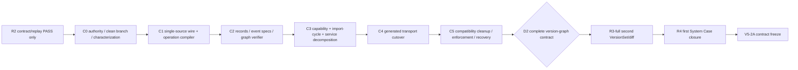

# CaseLoop V5 Architecture Convergence Plan

> Status: **ACTIVE CONVERGENCE PLAN / NOT IMPLEMENTATION PROOF**
>
> Decision: [D-015](../decisions/D-015-v5-default-development-baseline-and-v3-v4-compatibility-lanes.md)
>
> Current wave: **C1 ELIGIBLE / NOT STARTED**（C0 DONE: semantic series `a14784a` + `903e954`, verifier PASS P0=0/P1=0）
>
> Locked while C0–C5 remain open: **D2, R3, R4, V5-2+**

## 1. Purpose and outcome

This plan turns D-015 into a bounded repository convergence program. The outcome is a modular
monolith whose new product and domain work defaults to V5, while V3 and V4 remain explicit,
tested compatibility lanes.

Convergence is successful only when a contributor can answer, from code and contracts:

- which module owns each command, lifecycle and authoritative fact;
- which code is a compatibility façade or shared infrastructure;
- where one PostgreSQL unit of work begins and ends;
- which imports and calls are allowed between modules;
- which public behavior must remain byte- and cardinality-compatible;
- how a failed structural wave is stopped and recovered.

It is not a feature program. It does not implement D2, R3, R4, V5-2+, change the public default
major, or turn contract/replay proof into live runtime proof.

## 2. Fixed architecture

### 2.1 Modular monolith

The authoritative control plane remains one modular monolith backed by one PostgreSQL database.
Each business transaction uses one database unit of work. A module may call another module's
application interface within that unit of work; it may not reach through to the other module's
tables or create a second transaction for required facts.

Required domain rows, events, outbox rows, audits, AuthorityReceipts and idempotency terminal
results share the enclosing transaction. Optional external delivery occurs after commit and can
only report its own receipt/status.

### 2.2 Module classes

| Class | Candidate paths/responsibility | Authority rule |
|---|---|---|
| V5 domain | V5 models/contracts; Application Catalog, System Version, Case Binding, Acceptance and later admitted stage modules | May own only the commands/facts frozen for that module |
| V4 compatibility | V4 models, contracts, public façade and preserved governance compatibility | May validate/translate/dispatch; no new V5 owner |
| V3 compatibility | existing Scenario tables, routes, services, contracts and replay | Preserves implemented history; no new V5 owner |
| Shared authority kernel | database UoW, credential resolution, audit, idempotency, event/outbox, receipt/integrity and canonicalization | Major-aware infrastructure only; no business-success decision |
| Projection/transport/adapter | API, CLI, Console, capability discovery, read projections, MCP/A2A/provider adapters | No command ownership or hidden write path |

Files without a version prefix are not automatically shared. `application_catalog`,
`system_versions`, `acceptance`, `case_binding`, `issue_source` and V5 read models must be classified
by their actual owner. Conversely, a file named `v4_*` cannot become a permanent home for new V5
semantics merely because existing code calls it.

### 2.3 Allowed dependency direction

```text
public/API/CLI/Console/adapters
              ↓
compatibility facade or V5 application interface
              ↓
single owning domain module
              ↓
extracted foundation + owner repository
              ↓
one PostgreSQL unit of work
```

Forbidden directions include domain code importing a transport, one domain repository importing
another owner's tables, a compatibility façade bypassing the canonical service, and shared helpers
calling a domain command.

## 3. Current truth and deferred evidence

R2 is accepted only as `contract=PASS` and `replay=PASS` for the exact R2 scope. This plan does not
upgrade it to full runtime closure. Standalone version record/get/diff, R3-full, R4 and V5-2+ remain
locked and unimplemented unless their own later evidence says otherwise.

The product owner has deferred final subject SHA recording and evidence-bundle digest finalization
to final project closure. Every C-wave report must preserve the label
`DEFERRED_BY_OWNER_TO_FINAL_PROJECT_CLOSURE`; no wave may calculate placeholder values or treat the
deferral as a completed evidence facet. This exception does not authorize missing tests, hidden
findings, dirty-scope ambiguity or fabricated live status.

## 4. Wave DAG



No arrow may be bypassed by starting a later worktree. A wave can prepare a read-only inventory for
the next wave, but cannot edit the next wave's owned paths or claim its Exit.

## 5. Wave contracts

### C0 — Authority, clean branch, WIP inventory and characterization

**Status:** `DONE`. Semantic series `a14784a` + `903e954`; cumulative `c838b2b..903e954` = 2 commits / 17 paths; independent post-commit verifier PASS, P0=0/P1=0; SHA/evidence digest `DEFERRED_BY_OWNER_TO_FINAL_PROJECT_CLOSURE`.

**Entry:** D-015 owner decision; current Master and blueprint available; R2 truth limited to
contract/replay.

**Scope:** D-015 and the execution-plan delta; a clean convergence branch/worktree; exact inventory
of pre-existing WIP; current wire, validator, activated-operation, import graph, service/coordinator
and transaction-boundary characterization. C0 observes and classifies; it does not restructure code.

**Required result:**

- active architecture documents agree that V5 is the new-development default and V3/V4 are
  compatibility lanes;
- the convergence branch starts from an explicitly recorded clean base and unrelated WIP has an
  include/exclude inventory rather than being silently absorbed;
- characterization fixtures identify current source-of-truth duplication, registered versus
  unregistered operations, import cycles and transaction seams without calling them bugs by count;
- every document says this is not runtime/public cutover proof;
- C0–C5 and the D2 lock are explicit;
- modular-monolith, single-PostgreSQL-UoW and rollback invariants are written once and linked;
- R2 evidence deferral is labelled honestly.

**Verification:** clean-status and exact path inventory, Markdown/static link review,
terminology/status scan, reproducible characterization commands and independent P0/P1 review.
Creating the documents or recording a metric is not itself C0 closure.

**Stop:** dirty/ambiguous base, unclassified WIP, any document changing active routes/default major,
marking a later stage done, rewriting historical V3/V4 claims or inventing evidence identity.

**Rollback:** revert/supersede only the C0 authority delta; runtime and database remain untouched.

**Unlock:** C1 only.

#### C0 characterization snapshot

The following is an owner-supplied structural snapshot at `c838b2b`; C0 records it and does not
recalculate it in this document change:

| Characterized surface | Snapshot |
|---|---:|
| 8 hotspot files/surfaces | 11,223 LOC |
| `system_versions` | 2,744 LOC |
| `system_versions.import_manifest` | 656 LOC |
| `system_versions` reconstruction path | 521 LOC |
| `application_catalog` | 1,814 LOC |
| `public_v5` | 1,686 LOC |
| `v4_event_store` | 1,591 LOC |
| `v5_models` | 1,183 LOC |
| CLI `main` | 974 LOC |
| CLI `client` | 696 LOC |
| Console validators | 535 LOC |
| server models | 61 |
| CLI hand-copied models | 51; 46 same-named with server models |
| unregistered handlers | 7, approximately 439 LOC |
| CLI-unreachable init/issue paths | approximately 342 LOC |

These counts identify structural risk and convergence scope only. They are not proof of a defect,
dead code, implementation completeness, runtime reachability or a safe deletion target. C1–C5 must
confirm each path through compiler/registration, import and behavior parity before changing it.

### C1 — Single-source wire and activated-operation compiler

**Status:** `ELIGIBLE / NOT STARTED`（unlocked by C0 DONE; 须先完成 C0 gate review 再开工）。

**Scope:** establish JSON Schema 2020-12 plus the intent registry as the canonical source for public
wire shapes and activated operation metadata. Build a deterministic activated-operation compiler.
Generate candidate operation/schema artifacts and run generated validation beside legacy
Pydantic/CLI/TypeScript validation in shadow; legacy behavior remains active until C4.

**Required result:**

- each activated intent resolves to one JSON Schema 2020-12 request/response/error contract and
  exact registry metadata;
- subject-time implementation/verifier labels and current status/activation state have one
  mechanically derived interpretation; historical semantic-subject labels remain reconstructable
  without being mistaken for the current verifier verdict;
- draft, disabled, deferred and unregistered operations cannot enter compiler output;
- operation ids, paths, methods, scopes, principal rules, idempotency and capability metadata are
  generated from one activated-operation set;
- generated and legacy validators execute in shadow against the same fixtures/requests, with
  field/error mismatch recorded rather than silently coerced;
- compiler output is deterministic and has no database, service or transport side effect.

**Verification:** JSON Schema 2020-12 meta-validation; intent/schema referential integrity; exact
activated-operation allowlist; deterministic regeneration; positive/negative corpus through both
validators; unknown/additional field, discriminator, nullability and error parity. Public routes,
default major and legacy validators remain unchanged.

**Stop:** registry/schema disagreement, generated operation from a non-activated intent, shadow
accept/reject or error drift without an explicit adjudication, non-deterministic output, or compiler
logic importing domain services/database state.

**Rollback:** remove generated candidates/shadow hook and keep the legacy validator active; retain
the mismatch corpus and failed finding.

**Unlock:** C2 only.

### C2 — Foundation extraction: records, event specifications and graph verifier

**Status:** `LOCKED UNTIL C1 PASS`.

**Scope:** after C1 freezes wire inputs, extract closed record primitives, major-aware event
specifications and the exact-binding/graph verifier from version-named or oversized modules. The
foundation defines data and verification mechanics only; it does not own domain commands,
capability activation, transport generation or coordinator decisions.

**Required result:**

- record envelopes, exact bindings, AuthorityReceipt/event specifications and canonical graph
  verification have one import-safe implementation per contract major/profile;
- graph verification walks named child bindings, detects stale/tampered/cross-owner references and
  returns typed failure without choosing business success;
- event specifications remain declarative and preserve V3/V4/V5 event-version distinctions;
- foundation packages import no domain service, API, CLI, Console or adapter;
- existing transaction, event/outbox/audit/receipt/idempotency bytes and cardinality remain unchanged.

**Verification:** record/event schema corpus, graph traversal/tamper/cycle/cross-workspace attacks,
contract-major separation, deterministic canonicalization and import graph checks; existing
V3/V4/V5 behavior regression. C2 does not change transaction orchestration.

**Stop:** foundation type imports a domain service, verifier mutates state or selects success,
event spec changes wire bytes/cardinality, C1 schema is bypassed, or compatibility regression.

**Rollback:** restore prior record/event/verifier imports behind the same interface; retain failed
fixtures and preserve all committed facts.

**Unlock:** C3 only.

### C3 — Capability/import-cycle elimination and coordinator/service decomposition

**Status:** `LOCKED UNTIL C2 PASS`.

**Scope:** eliminate capability and import cycles exposed by C0–C2, classify every module/lane and
decompose oversized coordinators/services into owner-local application, domain and repository
components. Capability decisions consume C1's activated-operation output; coordinators compose
canonical owner interfaces inside one caller-owned PostgreSQL UoW. No new D2/R3/R4 behavior.

**Required result:**

- a mechanically checked module/lane and allowed-import map covers V5, V4 compatibility, V3
  compatibility, shared foundation and transports;
- import cycles, service locators, hidden global sessions and direct cross-owner table access are
  eliminated;
- each command enters one application interface and owner-local repository using the caller's UoW;
- manifest and other coordinators compose services but cannot become duplicate aggregate owners;
- capability resolution is separate from business execution and cannot activate an uncompiled
  operation;
- domain modules import no API/CLI/Console/provider implementation.

**Verification:** import/cycle and direct-table-access checks, capability filtering, coordinator
fault injection at every required write, exactly-one transaction/cardinality, preserved
contract/replay and response/error/audit/idempotency behavior.

**Stop:** capability/business authority merge, global session, split transaction, new route/intent,
standalone second-version behavior, altered lifecycle, duplicate owner or service-direct evidence
presented as public-path proof.

**Rollback:** route canonical calls back through the last verified module interface; retain
append-only facts and disable affected V5 mutations if parity cannot be restored.

**Unlock:** C4 only.

### C4 — Generated transport cutover

**Status:** `LOCKED UNTIL C3 PASS`.

**Scope:** cut OpenAPI, Python models/client surface, TypeScript models/validators, CLI commands,
router registration and capability façades to C1's generated activated-operation artifacts and C3's
canonical services. Keep shadow comparison and an explicit per-surface fallback during cutover.
MCP/A2A/SDK remain disabled unless already admitted by a separate stage.

**Required result:**

- generated OpenAPI/Python/TypeScript/CLI/router/capability artifacts share one operation identity and
  closed schema;
- only activated operations produce routes, CLI commands, help or discovery entries;
- public API/CLI default major remains unchanged;
- V3/V4 preserved paths retain payload, error, audit, receipt, digest and replay behavior;
- façade authorization and visibility checks occur before resource disclosure;
- no generated façade performs a second domain write or creates success after owner failure.

**Verification:** generated-versus-shadow OpenAPI/Python/TypeScript/CLI/model parity, route/help/
capability exact allowlists, byte/digest/cardinality fixtures, downgrade and scope attacks, Console
loading/empty/error/partial/UNKNOWN states and fallback drill.

**Stop:** generated/shadow mismatch, implicit V2 default, locked or unregistered operation exposure,
dual write, compatibility byte drift, secret in client bundle/log/persistence or façade-owned success.

**Rollback:** switch the affected surface to its verified legacy adapter, disable any unsafe V5
entry/capability and preserve mismatch evidence; do not rewrite domain facts.

**Unlock:** C5 only.

### C5 — Compatibility cleanup, effective enforcement and recovery verification

**Status:** `LOCKED UNTIL C4 PASS`.

**Scope:** remove only compatibility duplication proven obsolete by C4, turn shadow-only boundary
rules into effective import/registration enforcement, perform cross-wave integration and recovery
verification, and synchronize current status. C5 adds no feature behavior.

**Required result:**

- generated transport is effective while verified V3/V4 façades remain explicit and supported;
- hand-copied models, unregistered handlers and unreachable CLI paths are deleted or retained only
  after reachability and compatibility proof, never by hotspot count alone;
- module graph, compiler output and ownership checks pass from a clean checkout;
- each authoritative transaction has one PostgreSQL UoW and expected fact cardinality;
- fresh and populated migration/recovery paths are deterministic and fail closed on ambiguous
  history;
- V3/V4 compatibility and current V5 contract/replay suites pass;
- rollback drill disables affected V5 entry points while preserving compatibility and immutable
  facts;
- unresolved P0/P1 count is zero;
- status files agree that D2 is either unlocked or remains locked for a named reason.

**Evidence:** commands, counts, environment identities and findings are recorded honestly. Final
subject SHA and evidence digests remain deferred exactly as D-015 requires; the deferral is not a
PASS facet.

**Stop:** cleanup without C4 parity, removal based only on characterization counts, dirty or
unbounded subject, unknown migration semantics, unrepeatable parity, missing recovery owner, or any
later-stage implementation mixed into the convergence series.

**Rollback:** keep D2 and later stages locked, disable affected V5 mutation/dispatcher paths,
continue safe V3/V4 compatibility service, and reopen the earliest failed wave.

**Unlock:** D2 decision work only.

## 6. Cross-wave hard gates

Every wave fails closed on:

1. duplicate owner or unreachable authoritative state;
2. transaction splitting or partial success;
3. changed authorization order or opaque-visibility behavior;
4. public wire, error, audit, receipt, idempotency or replay drift;
5. V3/V4 history rewrite or V5 fact backfill without an explicit migration contract;
6. implicit public-major change or premature capability advertisement;
7. later-stage code, contract or status mixed into structural convergence;
8. test weakening, mock/live equivocation or deferred evidence described as complete;
9. destructive rollback that can lose append-only authority facts;
10. unresolved P0/P1 finding.

## 7. Migration and commit protocol

- C0 is authority/inventory/characterization only. C1 is compiler plus shadow validation only; it
  does not cut transports or change persistence. Any later required schema change must be additive,
  use the actual single Alembic head and have a separate migration owner.
- Use expand → backfill → validate → constraint/index → route. Do not dual-write the same fact as a
  compatibility strategy.
- Ambiguous legacy history produces a stable NO-GO and recovery guide, never a guessed backfill.
- Destructive downgrade is not the default rollback; stop routes/dispatchers and roll forward.
- Each wave uses an exact path/hunk allowlist and a single semantic subject. Structural and behavior
  changes are separate subjects.
- A verifier is read-only and does not inherit implementer conclusions. Failed evidence remains
  failed; repair uses a new semantic subject.
- Staging, commits, pushes and pull requests remain separately authorized.
- Owner-deferred final SHA/evidence-digest work occurs only at final project closure and must not be
  pulled into C0–C5 opportunistically.

## 8. Compatibility façade contract

A compatibility façade may:

- authenticate and resolve server-owned principal/scope/grant state;
- validate a preserved request and map it to a canonical command/query;
- translate a canonical result into a frozen legacy response;
- return a persisted audit/idempotency/receipt reference produced by the authoritative transaction.

It may not:

- write owner tables directly;
- translate failure, missing, partial, `UNKNOWN` or audit failure into success;
- emit an extra event/outbox/audit/idempotency receipt;
- replace an exact binding with latest/mutable state;
- activate a locked V5 intent or change the default major;
- become a second lifecycle, release, approval or recovery owner.

## 9. Recovery matrix

| Failure | Immediate action | Preserved state | Re-entry |
|---|---|---|---|
| Wire/compiler or shadow mismatch | Keep legacy validation/registration active; remove generated candidate | Frozen contracts, mismatch corpus, public behavior | C1 compiler/shadow gate |
| Foundation extraction parity | Restore prior record/event/verifier imports | Existing rows/events/outbox/audits/receipts | C2 foundation gate |
| Capability/import/UoW decomposition | Disable affected V5 mutation or route to last verified service path | Append-only V5 authority and replay evidence | C3 full gate |
| Generated transport compatibility drift | Fall back to verified legacy adapter; disable unsafe V5 capability | Canonical facts and safe V1 behavior | C4 generated/shadow parity gate |
| Migration ambiguity | Abort before partial rewrite; issue recovery guide | Legacy history and backup/export | Migration-owner approval + failed wave |
| C5 cleanup/enforcement/recovery failure | Keep D2/R3/R4/V5-2+ locked | All verified prior-wave subjects and compatibility service | Earliest failed wave, then C5 |

## 10. Completion language

Allowed before C5 closes:

- `D-015 ACCEPTED / NOT RUNTIME CUTOVER PROOF`;
- `C0 DONE`（semantic series `a14784a` + `903e954`, verifier PASS P0=0/P1=0), or the exact independently verified wave status;
- `R2 contract/replay PASS only`;
- `D2/R3/R4/V5-2+ LOCKED`;
- `SHA/evidence digest DEFERRED_BY_OWNER_TO_FINAL_PROJECT_CLOSURE`.

Forbidden before their own closure:

- `architecture converged`;
- `V5 runtime cut over`;
- `V5 complete` or `Core V5 complete`;
- `second VersionSet/diff implemented`;
- `V5-2 durable work implemented`;
- any live/provider/Agent/external/production PASS not backed by its real evidence.
