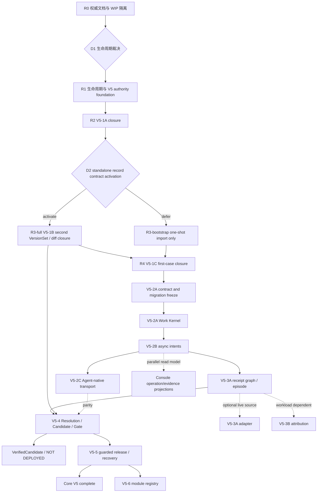

# CaseLoop V5 Master Execution Plan

> 状态：**ACTIVE LOCAL EXECUTION PLAN / NOT IMPLEMENTATION PROOF**
>
> 计划版本：`2026-08-11.2`
>
> 独立计划验收：`PASS`（2026-08-11；只证明依赖、authority、安全、migration、evidence、
> rollback 和提交编排可执行，不关闭任何 runtime stage）
>
> 当前分支：`codex/v4-foundation`
>
> 基线提交：`4a0a421cc669bf98d9b882d149d5d3df4c8dc36e`
>
> 当前事实：V5-0B/0C contract freeze 已完成；V5-1A/1B/1C repair worktree 已通过本轮
> 聚焦 verifier，但仍未形成逐 stage completion commit，因而保持 `IN_PROGRESS`。

本文把 [`docs/plan-v5.md`](../plan-v5.md) 和
[`v5-progressive-delivery.md`](v5-progressive-delivery.md) 转成可分派、可停止、可验证、
可回滚的工程施工总计划。本文只编排执行，不覆盖下列权威层：

1. 产品定位与范围：[`docs/product-principles.md`](../product-principles.md) 与
   [`D-013`](../decisions/D-013-v5-ai-system-governance-and-agent-native-control-plane.md)；
2. V5 目标架构和迁移约束：[`docs/plan-v5.md`](../plan-v5.md)；
3. owner、状态机、事件和 wire 合同：[`contracts/v5/`](../../contracts/v5/)；
4. 仓库施工、安全和 Definition of Done：[`AGENTS.md`](../../AGENTS.md)；
5. 当前事实和阻塞：[`PLANS.md`](../../PLANS.md)、
   [`PROJECT_STATE.md`](../context/PROJECT_STATE.md) 与
   [`LAST_HANDOFF.md`](../context/LAST_HANDOFF.md)。

当本文与以上权威层冲突时，立即停止相应 work package。先通过 ADR、合同变更和独立
复核解决冲突，不允许实现者自行猜测。

## 1. 完成口径

### 1.1 Core V5 complete

只有 V5-1、V5-2A/B/C、V5-3A-core、V5-4 与 V5-5 均满足各自 Entry、runtime、测试、
evidence、semantic commit 和 post-commit verifier，才可称 **Core V5 complete**。
V5-3A live source adapter 是独立 conditional-live slice；V5-3B Attribution 只在 workload
声明 required 时进入 Core Gate，不能用未运行的可选 slice 阻塞或膨胀核心完成口径。
Core V5 至少提供两条诚实出口：

- `LIBRARY_OR_OFFLINE`：Case → exact VersionSet → confirmed acceptance → V5-4 exact
  ResolutionContract materialization → exact-bound BadcaseSpec → Candidate →
  verification Gate → `VerifiedCandidate / NOT DEPLOYED`；
- `DEPLOYED_SERVICE`：在前述链路之上增加 pre-Gate ReleasePlan、release-authorization
  Gate、human Approval、ExternalOperation、desired assignment、independent observed
  verification、post-release Gate 和 rollback/reconcile。

任何 contract-only、fixture-only、Console-only、A2A Task completed、desired assignment
或 adapter receipt 都不能单独满足以上出口。

### 1.2 V5-6 不整体完成

V5-6 是开放模块注册表，不是一个可整体标记 `DONE` 的 mega-stage。Reliability、Supply
chain、Data/memory、Cost/vendor、Public ecosystem 和 Production 分别拥有独立 Entry、
migration、tests、evidence、rollback、commit 和 verifier。

### 1.3 Evidence facet 分栏

每个 work package 分别报告：

`contract`、`replay`、`domain-provider-live`、`agentteams-native`、
`claude-runtime-live`、`agent-causal`、`repo-sandbox`、
`human-authorized-external`、`production-canary`。

未执行必须写 `NOT_RUN`。连接失败、skip、空结果、未知状态和缺失 receipt 不能记作 PASS。

## 2. 当前基线与真实状态

| 项目 | 当前事实 | 执行影响 |
|---|---|---|
| Git | R0 subject=`4d15c1c81180386fa4852a53f8b8847e74cda050` 已 detached clean-checkout PASS；工作树仍包含大量未提交 V5 repair 与独立历史 WIP | 继续禁止 `git add -A`；每个后续 package 使用独立 provenance inventory 和精确 allowlist |
| V5-0A | 产品决策、D-013/产品原则 clean-checkout authority 已由 R0 关闭 | 不回写 V5-0B/0C 历史 freeze；不从文档 PASS 推导 runtime |
| V5-0B/0C | contract-only freeze 已独立 PASS | 保留历史 freeze；current runtime overlay 另行标注 |
| V5-1A | runtime/repair 存在；REGISTERED→ACTIVE 合同与 direct ACTIVE runtime 冲突 | 决策 `D1` 是阶段硬阻塞 |
| V5-1B | manifest import、VersionSet、GET/diff repair 存在 | standalone `system-versions.record` 与第二版本仍缺失 |
| V5-1C | local first-case、fresh reauth、Console/CLI repair 存在 | confirmed acceptance 仍等待 V5-4 ResolutionContract，不能 READY |
| V5-2+ | target/contract 或 skeleton | 不得 advertise 为 runtime；当前不允许混进 1A/B/C closure commit |
| live/external | 本轮均未执行 | 下一次 live 前仍需凭证轮换、redacted preflight 和逐动作授权 |

### 2.1 当前阶段状态

| Stage | 状态 | 解锁条件 |
|---|---|---|
| V5-0A clean-checkout closure | `DONE` | subject `4d15c1c81180386fa4852a53f8b8847e74cda050`；R0 evidence/verifier PASS |
| V5-0B/0C | `DONE (contract-only)` | 历史 freeze，不重开 |
| D1 lifecycle decision | `DONE (contract-only)` | subject `798531a`；evidence/verifier PASS；仅解锁 R1 施工，不证明 runtime |
| V5-1A | `IN_PROGRESS` | D1 + R1/R2 PASS |
| V5-1B | `IN_PROGRESS` | R3 PASS |
| V5-1C | `IN_PROGRESS` | R4 PASS |
| V5-2A–V5-5 | `TODO` | 前置 stage completion commit + evidence + verifier |
| V5-6 slices | `TODO / independently admitted after V5-5` | V5-5 completion evidence + 对应 slice Entry |

## 3. 施工依赖图



冻结蓝图允许 V5-1A 与 V5-2A 在 V5-0C 后并行。但当前仓库存在混合 WIP，且
`AGENTS.md` 要求逐 stage evidence、semantic commit 和 verifier。本计划因此选择更严格的
执行顺序：**先关闭 R0–R4，再启动 V5-2A**。只有新增 ADR/计划变更记录和独立 verifier
批准，才可重新开启并行施工。

## 4. 全局 stage protocol

每个 work package 必须完整填写以下字段；缺一项不得开始或关闭：

| 字段 | 要求 |
|---|---|
| User outcome | 用户获得什么可观察结果，不能只写内部表或接口 |
| Authority owner | 唯一 aggregate owner、允许的 command/event、禁止写入者 |
| Entry | 前置 completion commit、contract revision、migration head、授权和环境 |
| Scope | 文件 allowlist、明确输入输出、需同步的 contract/runtime/client/read model |
| Non-goals | 不属于本 work package 的能力与 facet |
| Migration | expand/backfill/constraint/route 顺序、锁风险、upgrade 与 recovery |
| Verification | unit、contract、negative/adversarial、real PG、CLI/Console、diff-check |
| Evidence | subject commit、dirty 状态、命令、环境、raw digest、facet、verifier |
| Stop gate | 发现什么必须立即 NO-GO，谁负责恢复准入 |
| Rollback | route disable、roll-forward repair、schema recovery、保留哪些 append-only facts |
| Commit | 单一语义、建议 message、禁止混入清单 |
| Unlock | 该包关闭后准确解锁哪个 work package |

### 4.1 固定 Definition of Done

1. canonical call path 实现，不能只测 service 直调；
2. authoritative rows、audit、idempotency 与 required outbox 同事务；
3. cross-workspace/project/environment、role、revision/digest、replay 与并发 fail closed；
4. migration 在 fresh DB 与 populated previous head 上通过；危险历史数据有显式 recovery；
5. focused unit/contract/PG/CLI/Console 测试按 blast radius 通过；
6. evidence manifest 绑定已提交 subject commit，raw artifacts 有 digest；
7. 独立 verifier 在 commit 后重验，没有 unresolved P0/P1；
8. `PLANS.md`、`PROJECT_STATE.md`、`LAST_HANDOFF.md` 同步；
9. 未运行的 live/provider/Agent/external/production facet 保持 `NOT_RUN`；
10. 下一 work package 的 Entry 能从仓库 clean checkout 独立重建。

### 4.2 Authority 与安全 closure gates

以下是 R1–R4 及后续复用的硬验收，不是可选测试建议：

1. trust role、project/environment grant、scope 与 credential 状态只从 server-persisted
   Principal/Credential/RoleBinding 派生；客户端自报 role/grant 永远不授权。每次 mutation、
   read 和 idempotency replay 都重验 credential 当前 active、未撤销、未过期以及资源可见性；
   unauthorized resource 对调用者保持 opaque not-found，不泄漏存在性、digest 或 audit ref；
2. Acceptance confirm 必须同时核对 path/body identity、exact proposal 与 Case revision/digest、
   当前 Case/source/version 未 stale、confirmer 与 proposer 分离，以及 fresh independent
   credential 的 JTI、claims digest、project/environment/scope。`issued_at` 必须严格晚于
   `proposed_at`；同一 proposal 的并发 confirm 最多产生一个 CONFIRMED revision；
3. public HTTP 不签发或轮换 owner/operator credential。local bootstrap、environment rotation
   与 owner reauthentication 是三次独立 management transaction；旧 credential 只可 revoke，
   不得回写旧 claims 冒充 fresh reauth；
4. denial audit 只有在错误类型显式标记、handler 严格验证 workspace/code/audit_ref/details、
   且事务中没有 business mutation、outbox 或 success-idempotency 时才允许单独提交。普通、
   malformed 和 internal error 全部回滚；audit 写入失败必须让 enclosing request 失败；
5. V5 domain event 固定 `contract_major=2`、`event_version=2.0`，并携带 named self 与 required
   dependent exact bindings。AuthorityReceipt 使用 closed shape，`source_event_id == event_id`，
   Controller bridge `contract_major=1`；read/replay 必须递归重验 scalar row、record envelope、
   controller registration、event、receipt 与 child bindings，不能只重算顶层 JSON digest；
6. API/CLI/capability discovery 必须来自同一显式 allowlist。尚未冻结或授权的 standalone
   `system-versions.record`、V5-2+、MCP/A2A/SDK 不得被 route、help 或 discovery 提前广告。

任一项缺失均为 P0 `NO-GO`；不能通过隐藏 route、放宽 response model 或只写 audit prose
降级为已知债务。

### 4.3 Migration 与 evidence 安全矩阵

每个涉及 schema/authority 的 closure 至少覆盖以下路径，并把命令与 raw digest 写进 manifest：

| 路径 | 必须结果 |
|---|---|
| fresh database → current head | migration、bootstrap、focused runtime PASS |
| populated 010/011、没有 V5 authority/event history → 012 | 确定性 upgrade PASS，JSON null/SQL NULL 与 SQLite/PostgreSQL 差异有回归 |
| populated 010/011、存在 legacy V5 authority/event history → 012 | 以稳定、可识别错误 fail closed；零部分改写，旧事件不重标 major-2 |
| 必须保留 legacy V5 history | 先 backup 与 restore drill，再 export→digest/shape verify→受审计 replay/recovery；operator 明确批准后才恢复 route |
| 011/012 或后续 authority migration rollback | 默认 route/dispatcher disable + roll-forward repair；downgrade 会丢 authority/append-only facts 时必须显式阻断 |
| evidence packaging | secret/PII scanner、redaction report、raw/artifact/receipt SHA-256、subject commit、dirty state、命令/环境、逐 facet 和 verifier 均齐全 |
| live/provider/production claim | 真实 provider/external receipt + 独立 readback；无凭证、回读或动作授权时保持 `NOT_RUN/BLOCKED` |

每个 stage brief 还必须声明 required facets；其他 facet 也要列出并保持 `NOT_RUN`，不能省略：

| Stage | closure required PASS facets |
|---|---|
| R0 | 文档 static checks；不产生 runtime facet PASS |
| R1–R4 | `contract`、`replay`；`repo-sandbox` 只有在真实满足 patch/test/no-escape 定义时才可 PASS |
| V5-2A/2B | `contract`、`replay`；fixture executor 不属于 `agent-causal` |
| V5-2C | `contract`、`replay`、真实外部 Agent 路径的 `agent-causal`；provider/production 仍可 `NOT_RUN` |
| V5-3A-core | `contract`、`replay`；live adapter 单独要求 `domain-provider-live` |
| V5-3B | `contract`、`replay`；只有真实 Agent 发起且 receipt 闭合时才增加 `agent-causal` |
| V5-4 | `contract`、`replay`、正确语义的 `repo-sandbox`；阶段 Exit 所述外部 Coding Agent 路径要求 `agent-causal` |
| V5-5 | `contract`、`replay`；发生外部动作时另要求 `human-authorized-external` 与独立 observed readback；`production-canary` 不因 local/shadow 自动 PASS |
| V5-6 | 每个 slice 按 adapter/action 分别声明；不得继承其他 slice 或 Core 的 facet |

## 5. Recovery lane：关闭当前 V5-1 worktree

### R0 · 文档权威链与 WIP provenance

**User outcome**：贡献者从 clean checkout 能确定当前产品边界、已实现能力、阻塞和下一步，
不会把历史 handoff、draft 或 worktree verifier 当作 stage DONE。

**Deliverables**：

- 纳入 D-013，并使 product principles、plan、contracts、Master Plan 与 current state 的链接闭合；
- 建立文档权威索引和 archive policy；
- 归档旧 `STATUS`、旧 Phase 1 execution 快照与 superseded V5 construction handoff；
- 生成当前 dirty worktree provenance inventory：`owned/current repair`、`historical preserved
  WIP`、`docs/presentation`、`live/provider`、`generated/evidence`；
- 为后续 commit 建立逐文件/逐 hunk include 与 exclude 清单。

**Stop gate**：任何 archive 候选仍被 runtime、contract、AGENTS 或 active plan 作为权威引用；
任何链接只能依赖未跟踪文件。

**Verification**：Markdown local link scan、tracked clean-tree link scan、状态词扫描、
`git diff --check`。

**Commit**：`docs(v5): restore execution authority and archive stale handoffs`

### D1 · Application/SystemComponent lifecycle

冻结合同要求 creation=`REGISTERED`，随后独立 `*.activated` 事件进入 `ACTIVE`；当前 runtime
在 register/import 时直接写 `ACTIVE`。

**Owner decision（2026-08-11）**：产品 owner 已选择方案 A，保留冻结生命周期。D-014、
semantic series `66052a1` + `798531a`、digest-bearing evidence 与 independent verifier
已经关闭 D1 contract gate（P0=0/P1=0）。这只解锁 R1 施工，不证明 lifecycle migration、
runtime、route 或 capability 已实现。

**选择的方案 A**：创建 append-only revision/history，使 register 产生
revision 1 `REGISTERED`，可信 manifest workflow 在同一受控事务内调用 activate 产生
revision 2 `ACTIVE`；下游 ComponentRevision 在记录时 exact 绑定 active SystemComponent
的当时 current authoritative lifecycle revision；initial manifest 是 revision 2，后续
deprecate/reactivate 后可为 revision 4 或更高，旧的 historical ACTIVE revision 不可复用。
VersionSet 再绑定该 ComponentRevision。该方案必须修改 migration
008 之后的 lifecycle constraints（当前 application 不允许 REGISTERED、component 不允许
REGISTERED），新增 history/constraint migration，并把 `system-components.activate` 纳入
trusted manifest workflow；不能只补 `applications.activate`。Public standalone activate
可继续 deferred，但 internal command、event、authority receipt 必须真实存在。

**拒绝的方案 B**：通过新 ADR/contract migration 把初态改为 `ACTIVE`。该方案实现更小，
但丢失显式 activation authority，产品 owner 已明确拒绝。

**Decision gate**：`DONE (contract-only)`；evidence 位于
`evidence/v5/decision-gates/d1-application-component-lifecycle/d1lifecycle_20260811T123512Z_798531a/`。
R1 已解锁施工，但在自身 migration/runtime/replay evidence PASS 前不得进入 R2；不得只改
测试或 overlay 掩盖 frozen/runtime 差异。

### R1 · V5 authority/event foundation

**依赖**：R0 + D1。

**Scope**：生命周期 revision storage/CAS、major-2 generic event envelope、exact subject/binding
resolver、AuthorityReceipt generic replay、migration head、read/replay integrity。R1 只实现
registration revision 1 event，以及 revision 1→2 storage/CAS 的显式 non-production harness；
它不实现可由 production caller 调用的 `*.activated` event route、direct revision-2 append
入口或 manifest composition。

**Migration**：当前 WIP head 为 012。若 D1 需要新表/列，使用实际 next head；Master Plan
不预占硬编码编号。012 本身会拒绝任何已有 V5 authority history；因此对未接受的 disposable
开发库使用明确的 rebuild-only 路径，对需要保留的历史使用 export→verify→replay/recovery
方案。不能把旧事件重标为 V5 major-2，也不能泛称 populated 010/011→012 upgrade PASS。
后续 migration 还需覆盖 populated 012 数据的 upgrade/recovery。

**Verification**：状态机 reachability、registration event、通过显式 non-production harness
验证 revision 1→2 storage/CAS 与 PostgreSQL concurrent exactly-one、generic envelope/receipt
replay、tampered row/envelope/scalar、fresh/populated migration。R1 evidence 必须把 revision-2
harness 标为 storage primitive，不能把它表述为 authenticated business activation replay。

**Exit / unlock R2**：R1 可在上述 foundation scope 内取得 `contract=PASS` 与 `replay=PASS`，
但所有 production activated-event route 与 direct revision-2 append 必须 deny-all/disabled；
D-014 的真实 manifest-only dual-authority activation 仍是 R2 的必过 Exit，不因 R1 primitive
PASS 而降级或视为已实现。

**Stop gate**：历史 ACTIVE row 无法确定性 backfill；任何 production 或通用 internal caller
可以发出 `*.activated` event 或直接 append revision 2；non-production harness 被导出为 capability/
route/service 或 evidence 把它表述为 business activation；read path 不能重建 revision/digest。

### R2 · V5-1A Application Catalog closure

**Current runtime candidate**：上述 11-intent R2 + workspace-initial one-shot R3-bootstrap slice
为 `IMPLEMENTED_PENDING_POST_COMMIT_VERIFIER`；这不是 `DONE/PASS`，也不改变 R3-full、R4 或
standalone `system-versions.record/get/diff` 的 `NOT_IMPLEMENTED`/disabled 状态。
CLI `system-manifest validate` 只是本地文件验证 utility，不是 public intent、transport 或
capability；`init`/repository discovery 归 R3-full，R2 CLI 与 capability discovery 必须隐藏。

**User outcome**：维护者可在授权 workspace/project 下注册、激活并读取一个 AIApplication、
Environment、SystemComponent 和 DependencyEdge，并完成一个 initial declared VersionSet 与
generation-1 desired assignment；系统不宣称第二 VersionSet、diff、observed runtime 或 external
effect。

**Scope**：Application Catalog service、HTTP/CLI、capabilities、Console Applications read
model、audit/idempotency/outbox，以及对应 contract overlay。为使“激活”在 standalone activation
全 transport forbidden 的前提下真实可达，R2 与 R3-bootstrap 显式耦合并只激活 11 个 public
intents：`capabilities.get`，Application/Environment/SystemComponent/DependencyEdge 各自的
register-or-record + get 共 8 个，scope-filtered `applications.list`，以及 bootstrap-only
`system-manifests.import`。R2 必须实现
真实 manifest activation coordinator/gate：从 exact authenticated `system-manifests.import` 建立不可伪造、
transaction-bound 的 authority context，校验 active `application-catalog-controller` 与 exact
initiating human-or-service principal，并在同一 PostgreSQL UoW 内完成 lifecycle revision、
activated event、outbox、controller audit、initiating-principal audit、closed AuthorityReceipt 与
idempotency terminal result；缺失、错绑或任一写入失败必须整事务 rollback。Standalone public
activation route 仍 disabled。Bootstrap import 可完成既有 first-bootstrap graph：catalog、
ComponentRevision、TopologyRevision、恰好一个 initial SystemVersionSet、BootstrapAttestation 与
generation-1 desired SystemAssignment；这只证明首次 declared bootstrap，不证明 R3-full、第二
VersionSet、semantic diff、observed runtime 或 release。

这里采用完整 one-shot R3-bootstrap producer compatibility：每个 ComponentRevision 必须精确绑定
同事务中从 append-only lifecycle history 锁定并解析出的当前 ACTIVE SystemComponent revision 2，
TopologyRevision、initial SystemVersionSet、BootstrapAttestation 与 generation-1 SystemAssignment
全部进入同一原子 response/idempotency replay。这里的 replay 严格限定为同一 idempotency key 与
同一 canonical request body，返回相同 terminal atomic response 且不创建任何新事实；不同 key
即使 body 或 manifest digest 相同，也因 workspace-initial one-shot 已消费而稳定返回 CONFLICT，
且不创建任何新事实。R3-full 仍独占 standalone `system-versions.record`、
第二 VersionSet、`system-versions.get/diff`；不得另造 catalog-only public manifest 子意图。

**Verification**：duplicate identity、cycle/fan-out、cross-tenant、role/scope、audit rollback、
same-key conflict、concurrent register/activate、Console loading/empty/error/partial/UNKNOWN；另须
证明 direct lifecycle/event call、syntactic manifest context、仅格式正确的 audit URI、伪 permit、
cross-session/transaction、missing controller/initiating audit/receipt/outbox 均 fail closed 且零
partial row，same-key retry 不产生第二 activation revision。

**R3-bootstrap coupling gate**：`capabilities.get` 只能公布上述 11 intents；bootstrap import 是
workspace-initial one-shot，只有所有 authoritative V5 domain tables 为空时才可创建或幂等回放
完整首图与一个 initial VersionSet。任何先行 standalone catalog REGISTERED row 都会关闭该
one-shot；后续多 Application/Environment/version 组合属于 R3-full。任何 standalone
`system-versions.record`、第二 VersionSet、diff claim、隐式 observed/effect 或绕开 manifest
coordinator 的 graph writer 均 fail closed。满足本 gate 只关闭 R2 + R3-bootstrap，不关闭
R3-full。

**Console/read gate**：Console Applications read model 只能调用 authenticated public
`applications.list/get`；不得依赖无鉴权 internal `/v1/applications`。`applications.list` 必须在
workspace/scope/object visibility 过滤后分页，使用 server-issued opaque cursor 与 closed response；
Console credential 仅由 UI 内存态提供，不进入 bundle、静态配置、日志或持久化状态。

**Evidence**：`evidence/v5/stage-1/application-catalog/<run-id>/`。

**Commit**：`feat(v5): close ai application catalog lifecycle`

### D2 · standalone `system-versions.record` contract activation

当前 product/JTBD 需要第二个 VersionSet 才能产生真实 diff，但 frozen/current contract 仍把
standalone `system-versions.record` 标为未授权、未冻结 wire。R3 开工前必须：

R2 的 bootstrap-only `system-manifests.import` 是唯一前置例外：它只可在 authoritative V5
domain 全空的 workspace 创建或幂等回放第一个完整 declared graph 和 initial VersionSet，不激活
standalone `system-versions.record`，也不构成第二 VersionSet 或 diff evidence。D2 与 R3-full
仍负责下面的 standalone wire 和第二 graph 能力。

- 冻结 request/response、scope/principal、idempotency、error、HTTP/CLI/capability mapping；
- 明确它只引用既有 catalog/revision/topology，不复用 first-import bootstrap authority；
- 更新 compatibility/intent registry/conformance，并由独立 verifier 通过；
- 若决定继续 defer，则只允许形成 `R3-bootstrap` 限定出口：one-shot bootstrap VersionSet，
  不得宣称可记录第二版本或完成真实 version diff 用户价值；`R3-full` 保持 TODO，并成为
  V5-4 Candidate base/target 施工的硬 Entry。

### R3-full · V5-1B SystemVersionSet closure

**依赖**：D2 选择并冻结 standalone record。

**User outcome**：同一 Application/Environment 可记录至少两个不可变 VersionSet，并获得
可信 semantic diff；manifest import 只负责首次原子 bootstrap。

**Deliverables**：

- 冻结并实现 standalone `system-versions.record` canonical intent；
- 请求只能引用已存在且通过 authority 验证的 Application、Environment、ComponentRevision、
  TopologyRevision，不暗建前置对象；
- HTTP、显式 V2 CLI、capabilities、contract、idempotency、audit、GET/diff 同步；
- `caseloop system-manifest record` 不再是 import 别名；
- second-version PG E2E 验证真实差异，不接受 self-diff 作为唯一证据。

**Verification**：mutable alias/UNKNOWN、dependency substitution、fan-out、dataset role、
dirty repository identity、same label/different digest、concurrent record、tampered GET/diff、
cross-application/environment binding。

**Evidence**：`evidence/v5/stage-1/system-version/<run-id>/`。

**Commit**：`feat(v5): record and compare immutable system versions`

### R3-bootstrap · 限定 one-shot 出口

只在 D2 明确选择 defer 时使用。它可关闭 manifest atomic bootstrap、GET 和 self-integrity
验证，但必须在 status/capabilities/evidence 中标为 `BOOTSTRAP_ONLY`：没有第二
VersionSet、没有真实 semantic diff、不能进入 V5-4 Candidate base/target。该限定出口不
得复用 `R3-full` completion message，也不得把缺失 standalone record 隐藏为“后续优化”。

### R4 · V5-1C First System Case closure

**User outcome**：真实 Issue 或 maintainer report 形成可审计的 Case，绑定 exact/UNKNOWN
系统版本，并获得 Maintainer/Domain Reviewer confirmed acceptance input；如果信息不足，
系统明确返回缺什么。

**诚实出口**：V5-1C 不产生 executable ResolutionContract。confirmed
AcceptanceCriteria 的 `resolution_contract_binding_status` 保持 `PENDING_MATERIALIZATION`，
CaseReadiness 保持 `NEEDS_ACCEPTANCE_CRITERIA`；只有 V5-4 exact materialization 后才可能
进入 executable Gate。

**Verification**：source prompt injection、edited/deleted/manual source、duplicate retry、
Case immutable digest、fresh owner reauth、two-confirmer race、denial audit、Console corruption
fail-closed、installed CLI + isolated PostgreSQL full journey。

**Evidence**：`evidence/v5/stage-1/first-system-case/<run-id>/`。

**Commit**：`feat(v5): close first system case intake`

### R5 · 独立运维加固包

Compose secret/readiness、loopback exposure、demo Alembic、OAuth secret separation、
notification DB isolation 等与 V5 stage 语义分开提交和验证，不得混入 R2–R4 completion
commit。历史 judge/live WIP 继续排除。

**Commit**：按实际单一语义拆成 `fix(ops): ...`；不使用一个“misc cleanup”提交吞并。

## 6. V5-2 Durable capability plane

### V5-2A · Work Kernel

#### 2A-0 Contract and ownership freeze

- 对齐 V4 WorkerTask/Attempt/Proposal/Decision/ExternalOperation 逻辑 owner；
- 裁决并冻结 Work 事件复用 V4 event contract，还是新增 schema-major-2 system profile；
  在该裁决前不得把 V5 catalog/event envelope 自动套给 WorkerTask/Attempt；
- 冻结 runtime profile、command/event、lease/fence/reconcile 和 outbox channel；
- 明确 Coordinator、Executor、Adapter、Exporter 的禁止写入矩阵；
- 更新旧 2A brief 的 migration head、major-2 event 和 current authority 模型。

#### 2A-1 Schema and migration

- WorkerTask、Attempt、lease、fence token、retry policy、cancel request、reconcile state；
- typed Proposal/Decision、reaction ledger、outbox delivery metadata；
- additive migration，fresh/populated previous head、upgrade、recovery 和锁风险测试。

#### 2A-2 Claim and fencing engine

- atomic claim、heartbeat、lease expiry、fence rejection；
- duplicate/cross-task replay、late receipt、worker crash；
- `UNKNOWN → reconcile` 后才允许 retry。
- `work.claim` 同一事务至少固定 task snapshot，创建 Attempt，发放 attempt-scoped runtime
  capability，并写 authority/audit/event/outbox receipts；任一步失败整笔回滚；
- v3 Case lease 到 V4 WorkerTask lease 使用显式 cutover/routing，不允许同一 task 出现 dual
  lease authority。

#### 2A-3 Outbox and reaction ledger

- 为 2A-0 选定的 versioned Work event channel 实现 PG dispatcher；现有 fixed legacy worker
  对 v4/V5 channel 的刻意忽略必须被显式处置，不能静默混用；
- per-aggregate causal order、claim fencing、retry/DLQ、consumer idempotency；
- reaction 只能提交下一个 owner command，不能写领域成功。
- Proposal accept 同一事务写 Decision、首个 downstream command/event、audit 和 outbox；
  Decision 成功而 downstream intent 丢失属于 ghost success，必须被事务约束拒绝。

#### 2A-4 Deterministic fixture executor

- 不依赖模型、AgentTeams 或 provider；
- 覆盖 crash before/after claim/output/decision；
- post-action Proposal、ghost success 和 ambiguous outcome 必须拒绝。

#### 2A-5 Closure

**Exit**：真实 PostgreSQL/outbox 下无 double lease、ghost success 或 ambiguous retry。

**Evidence**：`evidence/v5/stage-2/work-kernel/<run-id>/`。

**Commit**：`feat(v5): add durable governance work kernel`

**Non-goals**：2A 不开放 public route/MCP/A2A，不证明 Agent 或 provider live；fixture executor
PASS 只属于 contract/replay，不属于 `agent-causal`。

**Rollback**：停止新 claim 和 dispatcher，保留现有 task/attempt/decision/event/audit；等待
lease 到期或按 fence reconcile，确认无 UNKNOWN child 后再恢复。不得删除或重写已分配
Attempt。

### V5-2B · Async public intents

实现 `investigations.start`、`operations.get/list/cancel-request`，提供 CLI
`wait/follow/json`。detach 只停止客户端等待；cancel 只提交 stop request。Operation
`COMPLETED` 只表示可信领域 artifact 已产生，不等价于 Gate/Release PASS。

**Exit**：shell-capable Agent 能经 CLI 发起、断线、重连并观察一个 durable investigation。

### V5-2C · First Agent-native transport

在 canonical intent 上增加最小 Public MCP 或 A2A adapter。每次请求按 principal、scope、
resource visibility 过滤 capability；transport task 状态不复制领域状态机。

**Exit**：一个真实外部 Agent 通过 allowlisted transport 启动并观察 operation，获得结构化
artifact；没有 approval/release 权限。

## 7. V5-3 System evidence

### V5-3A-core · Receipt graph and SystemEpisode

拆为：source-neutral receipt envelope → coverage/completeness → mutable EpisodeView → immutable
EpisodeSnapshot → ObservedStateSnapshot/ExternalEffectReceipt → Console/read model。

**硬规则**：declared、observed、effect 分栏；Gate/attribution 只能绑定 immutable snapshot；
repo-sandbox 不能冒充 provider/live；缺 source 或 retention gap 必须 PARTIAL/UNKNOWN。

**Exit**：一个 First System Case 有可审计的 declared/observed/effect 分栏和 missing evidence。

### V5-3A-adapter · Conditional live source

Langfuse、OTel 或其他 source 每个 adapter 单独准入。没有合法隔离 credential 或现场环境时
保持 `NOT_RUN`，不阻塞 3A-core。

### V5-3B · Attribution

只有 workload 将 attribution 声明为 required 时才阻塞 V5-4。否则可输出
`INCONCLUSIVE/CONFOUNDED/INSUFFICIENT_EVIDENCE` 并允许独立 Candidate 进入验证，不能
声称 root cause。

## 8. V5-4 Candidate, Evaluation and Gate

### 4A · Resolution materialization and executable badcase

#### 4A-0 Materialization contract freeze

当前 V5 只冻结了 Acceptance 的 `PENDING_MATERIALIZATION` 状态和 BadcaseSpec 对 exact
ResolutionContract 的依赖，尚未冻结 materialization command/event/wire/idempotency profile。
任何 runtime 施工前必须完成独立 contract gate：

- 裁决并记录 logical Case Controller、`resolution-contract-controller` 状态标识和 V4
  `resolution-contracts.freeze` owner 的兼容映射；不得出现两个可写 owner；
- 冻结 V5 major-2 ResolutionContract record、canonical command/event、HTTP/CLI capability、
  exact request/response、scope/role、idempotency、authority receipt 与 audit；
- command 输入至少 exact 绑定 QualityCase、CONFIRMED AcceptanceCriteria、Application/
  Environment/SystemVersion 和适用的 source snapshot；输出 exact ResolutionContract binding；
- 同一事务写 ResolutionContract、event、AuthorityReceipt、audit 和 success idempotency；
  concurrent materialize 最多一个 canonical result；same-key/different-body 冲突；
- stale Case/source/version/acceptance、wrong project/environment、proposer self-elevation、
  missing controller/receipt、digest/revision mismatch 全部 fail closed；
- contract/conformance/compatibility 先独立 freeze 并由 verifier PASS，再允许 migration/runtime。

#### 4A-1 ResolutionContract materialization

从 confirmed AcceptanceCriteria 生成并 exact seal ResolutionContract，解除 V5-1C
`PENDING_MATERIALIZATION`。此时仍未自动产生 executable badcase 或 READY。

#### 4A-2 BadcaseSpec recording

Case Controller 只能在 exact ResolutionContract 已存在且重新验证后记录 subordinate
BadcaseSpec；它同时绑定 exact Case、ResolutionContract 和 confirmed AcceptanceCriteria。
BadcaseSpec 不能反向创建、改写或补造 ResolutionContract。

#### 4A-3 Readiness projection

只有 exact materialized ResolutionContract 与 executable BadcaseSpec 均通过 authority/
integrity 重验，CaseReadiness 才能从 NEEDS 进入 READY。任一 stale/mismatch/corruption 都投影
为 NEEDS 或 UNKNOWN/integrity_error，不能沿用 scalar 状态误绿。

### 4B · Candidate and evaluation assets

- SystemCandidateRevision、base/target VersionSet、component diff；
- EvaluationBundle、sealed holdout、workload/deployment profile；
- external Agent 只能 submit Candidate/Proposal，不能确认、Gate 或 release。

### 4C · Two-purpose Gate

- `CANDIDATE_VERIFICATION` PASS 只产生 VerifiedCandidate；
- `RELEASE_AUTHORIZATION` 另绑定 pre-Gate ReleasePlan，只有它可创建 WorkOrder；
- required hard failure 不能被总分/Judge 覆盖；uncalibrated Judge 只能 advisory。

### 4D · Gate self-test

回放至少一例“测试通过但未修好”的已知无效 Candidate 和一例真实已接受修复，报告
false-pass、false-block、维护者一致性和分母。

**Exit**：真实外部 Coding Agent 经 CLI/Agent transport 提交 exact Candidate；Gate 给出
与 confirmed acceptance 对齐的可解释结果，verification 与 release authorization 不混淆。

## 9. V5-5 Guarded release and recovery

### 5A · Human authority and capability

实现 schema-major-2 ApprovalGrant、CapabilityLease、reauth、nonce、expiry、exact WorkOrder/
Gate/ReleasePlan binding。Agent token 永远不能 approve 或 execute。

### 5B · ExternalOperation and desired assignment

Scoped Executor 只消费 sealed 参数；provider response loss 使用 exact resource reconcile；
Version Controller 经独立 command 更新 desired assignment，Executor 不直写。

### 5C · Independent observation and post-release Gate

从目标进程、容器或 version endpoint 回读实际 loaded revision/digest。desired 回读不算
observed。重跑原 badcase、适用 regression 和 recurrence observation。

### 5D · Rollback and recovery drill

每次 rollback 使用 fresh break-glass ReleasePlan、RecoveryWorkOrder、reauthenticated human
approval 和新的 `SYSTEM_ROLLBACK` operation。先 stop exposure，再 restore desired，验证
observed，reconcile in-flight/UNKNOWN，最后才 resume。

**Exit**：deployed-service 的 local/shadow 路径完成 independent observed digest、post-release
Gate 和 rollback drill；没有外部授权时明确 `NO REMOTE WRITE PERFORMED`。

## 10. V5-6 module admission registry

按已接受蓝图，V5-6 只有在 V5-5 完成后才准入；不提前借 read-only 名义改写 stage 依赖。
进入 V5-6 后，每个 slice 再拆 read/advisory 与 write/enforcement 两层。write/enforcement
必须额外复用 V5-5 authority、ExternalOperation 和 recovery invariants。

| Slice | Read/advisory first exit | Write/enforcement additional gate |
|---|---|---|
| Reliability | Case→Problem→PIR、SLO/ErrorBudget projection | freeze rollout 需 V5-5 capability/recovery |
| Supply chain | BOM/provenance/permission diff | revoke 需 exact impact set、approval、reconcile |
| Data/memory | lineage、污染定位、quarantine proposal | rebuild/revert 需 observed verification 与 recovery |
| Cost/vendor | CostEvent、RateCard、Budget/EOL finding | budget enforcement 需 durable operation 与 human policy |
| Public ecosystem | MCP/A2A/SDK/webhook read parity | mutation parity 需 canonical intent 和 scope audit |
| Production | backup/restore/key rotation runbook | N/N-1、multi-tenant、DR 各自独立 evidence |

### 10.1 后续 stage packet 矩阵

下表补齐各 stage 的执行字段；详细领域语义仍以 plan-v5、progressive blueprint 和 frozen
contracts 为准。

| Stage | Entry / authority / non-goals | Migration 与验证 | Evidence / stop / rollback / commit / unlock |
|---|---|---|---|
| V5-2B Async intents | Entry：2A 双提交闭环 PASS。Work Controller 拥有 durable task；Public Gateway 只接 canonical command/read projection。Non-goal：operation completed 不等于 Gate/Release success | Additive operation projection/cursor；HTTP/CLI auth、idempotency、timeout、Ctrl-C、detach、cancel-request、stale cursor、cross-workspace、replay 与 PG restart | Evidence `stage-2/public-operations/<run-id>`；transport→domain 状态膨胀即 NO-GO；rollback 禁用 routes/新 dispatch，保留 tasks；commit `feat(v5): expose durable governance operations`；解锁 2C、3A-core |
| V5-2C Agent transport | Entry：2B PASS、protocol/version 当期复核。Adapter 无领域 owner；Non-goal：human approval、internal execute、复制状态机 | 无领域表时不造表；如需 task mapping/cursor 只 additive。验证 OAuth/audience/scope、capability filtering、downgrade、disconnect、duplicate task、artifact/status equivocation、HTTP/CLI parity | Evidence 使用 canonical facets，client-live 仅 metadata；scope/authority 扩张即 NO-GO；rollback 关 adapter/revoke credential，保留 operations；commit `feat(v5): add first agent-native gateway`；解锁 transport parity，不阻塞 3A/4 的 CLI 路径 |
| V5-3A-core Evidence | Entry：2B PASS、1C Case 可引用。Evidence Controller 拥有 receipt/snapshot；projection/source adapter 无 success authority。Non-goal：真实 source、归因 verdict、Gate | Additive receipt graph、view/snapshot、observed/effect tables；验证 missing/sampling/masking/retention、desired!=observed、view watermark/generation、immutable snapshot、exporter fabrication、cross-workspace、PG concurrency | Evidence `stage-3/system-evidence/<run-id>`；mutable view 被 Gate 绑定或 sandbox 冒充 live 即 NO-GO；rollback 停 ingestion/projection rebuild，保留 receipts/snapshots；commit `feat(v5): add system episode evidence`；解锁 3A-adapter、3B、4 |
| V5-3A-adapter | Entry：3A-core PASS、合法隔离 credential、现场可回读。Adapter 只产 source receipt。Non-goal：改变 core/competition closure | Additive source config/cursor/DLQ；验证 broad credential、timeout、cursor replay、sampling gap、masking、retention、ambiguous outcome 和 readback | Evidence `stage-3/source-adapter/<run-id>`；无回读则 `NOT_RUN/BLOCKED`；rollback 关 source/revoke credential，保留已固化 receipt；commit `feat(v5): add <source> evidence adapter`；不阻塞 4 |
| V5-3B Attribution | Entry：3A-core PASS，且 workload 选择启用。Attribution owner 只写 frozen plan/report。Non-goal：Agent hypothesis=verdict、默认阻塞 Gate | Additive AttributionPlan/Report；验证 multi-change、low power、contaminated control、unavailable rollback、paired randomization、hidden confirmation | Evidence `stage-3/attribution/<run-id>`；不能诚实估计时输出 INCONCLUSIVE/CONFOUNDED；rollback 停 runner，保留 plan/report；commit `feat(v5): add evidence-bound system attribution`；只有 required workload 才阻塞 4 |
| V5-4 Candidate/Gate | Entry：R4、R3、3A-core PASS，且 4A-0 materialization contract 独立 freeze/verifier PASS；CLI 或已验 transport 可提交 Candidate。Resolution/Badcase/Proposal/Evaluation/Gate 保持单一 owner。Non-goal：verification PASS 自动 release | 先 additive ResolutionContract profile/runtime，再 exact-bound BadcaseSpec/readiness，最后 Candidate、EvaluationPlan/Bundle、GateReport、ReleasePlan/WorkOrder；验证 materialization 并发/幂等、stale Case/source/version/acceptance、Badcase 无 RC、source/version换绑、holdout leak、stub/弱断言、hard failure、Judge calibration/applicability、two-purpose Gate、self-test false-pass/false-block | Evidence `stage-4/system-candidate/<run-id>`；owner 未裁决、Badcase 先于 RC、缺 required evidence、release plan 后补参数或 Task success 冒充 Gate 即 NO-GO；rollback 先停 materialize/Candidate routes，再拒 Candidate/销毁 sandbox/保留 authority/finding；contract freeze 与 runtime 各自 semantic/evidence commit；解锁 VerifiedCandidate 和 release-applicable V5-5 |
| V5-5 Release/recovery | Entry：release-authorizing Gate PASS、DEPLOYED_SERVICE、V4 Stage-4 successor runtime、独立可回读 target、动作授权。Approval/Capability/ExternalOperation/Version/Evidence 各自 owner。Non-goal：library/offline 强行部署、remote write 默认授权 | Additive ApprovalGrant、CapabilityLease、Operation/receipt/recovery；验证 hash/nonce/expiry/base drift、Agent self-approve、provider response loss、desired/observed mismatch、partial/UNKNOWN、post-release recurrence、fresh rollback authority | Evidence `stage-5/guarded-release/<run-id>`；任一 required child/effect UNKNOWN 或 audit failure 即 NO-GO；rollback stop exposure→fresh recovery authority→restore desired→verify observed→reconcile/compensate→resume；commit `feat(v5): add approval-bound system release recovery`；解锁 Core V5 和 V5-6 write/enforcement |
| V5-6 slice | Entry：V5-5 completion evidence + 该 slice 精确依赖；进入 slice 后先 read/advisory、再 write/enforcement。每个 slice 冻结自己的 owner。Non-goal：用一个 slice PASS 宣称整个 V5-6 | 每 slice 独立 additive migration、focused positive/negative、replay、idempotency、permission、UNKNOWN/reconcile、conditional-live | Evidence `stage-6/<slice>/<run-id>`；依赖或 recovery invariant 缺失即不准入；rollback 关 route/adapter/dispatcher、撤 capability、保留 facts；独立 semantic/evidence commits；只解锁该 slice 下一层 |

### 10.2 文件所有权与默认 allowlist

下表是 stage brief 的默认候选路径，不是跨 stage 的空白写权限。每个 work package Entry
必须把它收窄成精确文件/hunk allowlist，并记录开工时已有 diff；新增共享 model、migration、
public API 或 contract 文件必须指定单一 owner。

| Work package | 默认 owned paths | 默认排除 |
|---|---|---|
| R0 | 根产品/authority README、current status、D-013、Master/blueprint、文档索引、archive+redirect 和 `R0_DOCUMENTATION_PROVENANCE.md` 中的精确 path/hunk allowlist | 组件 README、runtime/contract/migration、First Case runbook、evidence、presentation、live/provider 与 generated WIP |
| R1 | `control-plane/app/models/v4_tables.py`、`v5_tables.py`、`services/v4_event_store.py`、`v5_authority.py`、新 Alembic revision、`contracts/v5/{events,state-machines,schema-profiles}.yaml`、focused tests | Application/SystemVersion/Case 业务扩展、ops/live WIP |
| R2 | `services/application_catalog.py`、V5 catalog API/model/capability/CLI surface、Applications Console/read model、1A contracts/tests | SystemVersion、Case/Acceptance、V5-2 |
| R3 | `services/system_versions.py`、repository discovery、SystemVersion API/model/CLI、1B contracts/tests | Case/Acceptance、Candidate/Gate |
| R4 | `services/{issue_source,case_binding,acceptance,read_views}.py`、Case V5 API/model/CLI、Case Console、1C contracts/tests、本地 First Case runbook | V5-2 Work、V5-4 fake ResolutionContract、public credential issuance |
| R5 | `deploy/**`、`demo-app/**`、control-plane readiness/config、notification DB isolation 及 focused tests/docs | 1A/B/C stage semantic commit、provider/live execution |
| V5-2A | `contracts/v5/` 新 Work runtime profile、control-plane Work/Proposal/Decision model/service/worker/migration、deterministic fixture executor、focused tests | public async routes、MCP/A2A、Agent/provider、Gate/release |
| V5-2B/2C | operation public model/service/read projection、V2 API/CLI；2C 的单一 transport adapter 与 auth tests | Work owner state、human approval、internal execute |
| V5-3 | receipt/Episode/Observed/Effect 与 Attribution model/service/migration/read model；adapter 独立子目录 | Candidate/Gate、release authority、source 把 partial 冒充 complete |
| V5-4 | Resolution/Badcase/Candidate/Evaluation/Gate owner、sandbox/eval harness、contracts/read models/tests | Approval/ExternalOperation、verification PASS 自动 release |
| V5-5 | Approval/Capability/ExternalOperation/Assignment/Observation/Recovery owner、scoped adapters、Console approval/recovery surface | Agent approval、Executor 直写 Version、未授权 remote write |
| V5-6 | `contracts/v5/modules/<slice>/` 与该 slice 独立 runtime/migration/test/evidence path | 其他 slice、共享 owner 的隐式改写、mega-stage completion claim |

任何路径同时落入两个活跃 package 时，后开工者停止；由 task controller 拆 owner 或串行化，
不允许通过“共享工作树”默认合并。

## 11. 测试矩阵

| 层 | 每阶段最小要求 | 不能证明 |
|---|---|---|
| Static | parse、schema/YAML unique keys、Markdown links、diff-check | runtime |
| Unit | owner/service 正反路径、digest、state transition | transaction/concurrency |
| Contract | frozen/current overlay、wire/CLI/capability parity | route 已部署或 live |
| Migration | fresh + populated previous head；upgrade/recovery | zero downtime，除非专项证明 |
| PostgreSQL | idempotency、locks、lease/fence、audit/outbox transaction | external provider |
| CLI/Console | installed client、malicious response、UNKNOWN/error states | authority，除非回读 PG 验证 |
| Replay | deterministic fixtures 和已录制 receipt | provider-live/agent-causal |
| Conditional live | provider/source/Agent/external adapter 的真实回读 | production canary，除非另验 |

测试命令必须写入 evidence manifest。不得只记录“suite green”；记录实际 command、exit code、
passed/failed/skipped、环境非秘密标识和 raw output digest。

## 12. Evidence bundle contract

每个 stage evidence 目录至少包含：

```text
evidence/v5/stage-<n>/<slice>/<run-id>/
├── run-manifest.json
├── verification.md
├── verifier-report.md
├── commands/
├── raw/
├── receipts/
└── artifacts/
```

`run-manifest.json` 至少记录：

- stage、slice、run id、开始/结束时间；
- subject commit full hash、branch 和 `dirty=false`。只有 WIP verifier 可以记录
  `dirty=true` 与显式 allowed dirty paths，且 verdict 上限为 `WIP_REVIEW_PASS`；
- contract/migration versions；
- 实际命令、cwd、exit code、测试计数；
- PostgreSQL/container/provider/runtime 的非秘密 identity；
- 每个 canonical facet 的 PASS/FAILED/NOT_RUN；
- raw/artifact/receipt 相对路径和 SHA-256；
- known gaps、stop-gate 结果和 rollback 状态；
- verifier identity、verifier subject commit 与最终 verdict。

worktree verifier 只可标 `WIP_REVIEW_PASS`，不能关闭 stage。stage closure 必须在 semantic
commit 后运行 verifier，并让 manifest 绑定该 commit。

## 13. Git、migration 与并行纪律

### 13.1 Commit stack

建议顺序：

1. `docs(v5): restore execution authority and archive stale handoffs`
2. `fix(ops): ...` 独立运维加固提交；
3. lifecycle/authority foundation；
4. V5-1A runtime semantic commit → clean checkout evidence/verifier → V5-1A evidence/status commit；
5. V5-1B runtime semantic commit → clean checkout evidence/verifier → V5-1B evidence/status commit；
6. V5-1C runtime semantic commit → clean checkout evidence/verifier → V5-1C evidence/status commit；
7. 每个后续 work package 同样使用“runtime semantic commit → post-commit verifier/evidence →
   evidence/status commit”双提交闭环。

Evidence commit 只记录对前一个 immutable subject commit 的验证结果，不把新的 runtime
行为塞入 evidence/status 提交。若 verifier 发现缺陷，先产生新的修复 semantic commit，
原 evidence 保留 FAILED/REJECTED，不改写 subject。

真正 `git add`、commit、push、PR 仍需对应授权。禁止 `git add -A`、重写公共提交、force push
或把 unrelated WIP 塞入 completion commit。

### 13.2 Migration protocol

- migration 编号从实际 Alembic current head 动态分配，不从旧 brief 复制；
- expand schema → backfill → validate → constraint/index → route；
- JSON `null` 与 SQL NULL、SQLite 与 PostgreSQL、populated history 均需覆盖；
- destructive downgrade 不作为默认 rollback；有 append-only authority rows 时优先停止 route
  并 roll forward repair；
- migration 检测到无法确定解释的 legacy history 时 NO-GO，输出 recovery guide，不猜测回填。

### 13.3 Team ownership

- 任务按不重叠文件/aggregate 分配；共享模型、migration、public API 设单 owner；
- agent 开工前记录 allowlist、exclude list 和当前 diff；完成后报告实际触碰文件；
- verifier 只读，不继承实现者结论；
- 发现其他 lane 问题时记录 finding，不越权顺手修改共享文件。

## 14. Stop gates and recovery owners

| Stop condition | 状态 | 恢复责任 |
|---|---|---|
| 重复 owner、不可达状态、隐式 success | `NO-GO` | contract owner + independent verifier |
| workspace/project/environment/role 越权 | `NO-GO` | security/authority owner |
| exact binding 或 receipt 无法重算 | `NO-GO` | aggregate owner |
| migration legacy data 语义不确定 | `NO-GO` | migration owner；先写 recovery plan |
| audit/outbox 与业务事实非同事务 | `NO-GO` | service owner |
| double lease、ghost success、ambiguous retry | `NO-GO` | Work Controller owner |
| required evidence 非 PASS 或缺失 | fail closed | Gate/Resolution owner |
| 外部授权、凭证轮换或 redacted preflight 缺失 | `NOT_RUN/BLOCKED` | human operator |
| worktree 无法隔离 semantic scope | `NO-GO` | task controller；先拆 provenance/commit |

## 15. 风险注册表

| 风险 | 当前级别 | 缓解 |
|---|---|---|
| 巨大混合 worktree 造成 provenance 污染 | High | R0 文件/hunk inventory，逐提交 verifier |
| frozen/runtime lifecycle 分裂 | High | D1；不以 overlay 隐藏 |
| second VersionSet 不可达导致 diff 仅 self-diff | High | R3 standalone record + PG E2E |
| V5-1C 提前冒充 executable readiness | High | 明确 pending 到 V5-4 |
| V4/v3/V5 owner 复制 | High | contract matrix + no-command projection tests |
| V5 outbox 被 legacy dispatcher 忽略 | High | V5-2A 独立 dispatcher/reaction closure |
| 计划目录存在旧“当前”快照 | Medium | archive policy + docs index + snapshot header |
| live/provider 历史被误当当前证据 | High | facet 分栏、subject commit、NOT_RUN |
| V5-6 范围失控 | Medium | per-slice admission；read/write 分层 |

## 16. 计划更新与完成报告

任何 split、reorder、skip、abandon 或 owner/security/cutover 改动必须：

1. 记录触发证据；
2. 复核 dependency、authority、migration 和用户出口；
3. 必要时新增或 supersede ADR/contract；
4. 更新本文件、`PLANS.md`、`PROJECT_STATE.md`、`LAST_HANDOFF.md`；
5. 保留历史 evidence 和 completion claim，不原位改义；
6. 由独立 verifier 复核新的 Entry/Exit。

每次 handoff 只保留一个 current section。旧 handoff 移入 `docs/archive/context/`，并记录
原路径、适用 commit/date、superseded-by 和禁止推导的能力。

## 17. 下一执行队列

1. 重排未提交 migration 链，按 `010 → 011 lifecycle/authority foundation → 012 event envelope → 013 V5-1C hardening` 保持 R1 先于 R4；
2. 实施并关闭 R1 authority/event foundation，完成 clean migration/replay evidence 和 independent verifier 后才进入 R2；
3. 按 R2→R4 逐包实施、提交、验证；
4. D2 冻结完整 version-graph recording bundle，而非只增加一个无法产生第二 graph 的 VersionSet endpoint；
5. 只有 R4 post-commit verifier PASS 后，重写并冻结 V5-2A 施工 brief。
